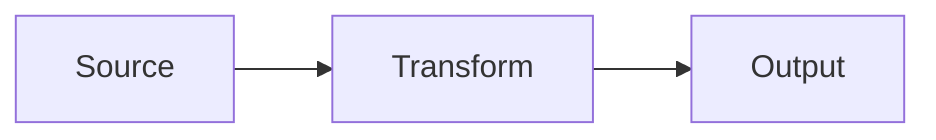

## Introduction

Start your blog post here with an engaging introduction.

## Main Content

Write your main content using Markdown formatting.

### Subsection

You can use:
- Lists
- **Bold text**
- *Italic text* (renders as non-italic weighted emphasis per site policy — see CLAUDE.md)
- [Links](https://example.com)
- `Code snippets`

### Code Blocks

```python
def hello():
    print("Hello, world!")
```

### Math

Inline: $E = mc^2$ — KaTeX loads only when `$...$` appears in the post.

### Diagrams



Mermaid loads only when a ` ```mermaid ` block appears in the post.

**Always use a fenced ` ```mermaid ` block — never a blockquote.** A
blockquote like `> flowchart LR / > A --> B` looks diagram-shaped in
the source but markdown-it renders it as prose, so the `-->` arrows
escape to literal `--&gt;` on the page and Mermaid never picks them
up. If a diagram is small enough that pulling in the Mermaid runtime
feels heavy, use a plain ` ```text ` fence with ASCII/Unicode box-art
instead — that renders as monospace inside `<pre>` and stays static.

## Conclusion

Wrap up your thoughts here.

---

## Frontmatter reference

- **title** — appears as `<h1>`, `<title>`, OG tag, and JSON-LD headline.
- **description** — shown in the blog listing and OG tag. 1–2 sentences.
- **publishDate** — `YYYY-MM-DD`. Used for sort order on the listing.
- **draft** — `true` keeps the post out of the built site and sitemap. Omit or set `false` to publish.
- **tags** — optional array of strings. Not currently rendered, kept for future use.

## Filename guidelines

- Lowercase, hyphen-separated.
- The filename stem (minus `.md`) becomes the URL slug: `my-post.md` → `/blog/my-post/`.
- Save to `src/content/blog/your-filename.md`.
- Prefix with `_` (e.g. `_draft.md`) to keep a file on disk but fully skipped by the build.

## Scaffolding and author notes — do not ship

If you are scaffolding a stub (section headers only, author notes to yourself
about what to cover), **keep `draft: true` until the prose is written**. Two
rules keep unfinished scaffolds from leaking onto the live site:

- **Never publish with `<!-- ... -->` author notes still present.** Markdown-it
  passes HTML comments through as literal HTML blocks. On a rendered page they
  display as visible `&lt;!-- ... --&gt;` text. Strip them before flipping to
  `draft: false`.
- **Never nest a fenced code block (` ```mermaid `, ` ```python `, etc.)
  inside an HTML comment.** The parser treats the block boundary as the end
  of the HTML region, then escapes the remainder of the document as literal
  text. If you need to sketch a diagram in an author note, write it as plain
  prose or put it in a separate `_scratch.md` file.

The pipeline is intentionally lenient about HTML — don't change
`scripts/build_blog.py` to work around an unfinished scaffold. Fix the post,
not the pipeline.

These two rules (plus "no blockquote-as-diagram" in the Diagrams section above)
are enforced by `scripts/lint_blog.py`, which runs in CI before the build and
can be run locally as a pre-push check.

## Build

Local:
```bash
pip install -r scripts/requirements.txt
python scripts/lint_blog.py    # source-side lint
python scripts/build_blog.py   # renders posts to /blog/
```
CI: `.github/workflows/build_blog.yml` runs lint then build on any push under
`src/content/blog/` or `scripts/`. Lint failure blocks the build.
