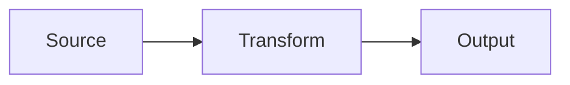

## Introduction

Start your blog post here with an engaging introduction.

## Main Content

Write your main content using Markdown formatting.

### Subsection

You can use:
- Lists
- **Bold text**
- *Italic text* (renders as non-italic weighted emphasis per site policy — see CLAUDE.md)
- [Links](https://example.com)
- `Code snippets`

### Code Blocks

```python
def hello():
    print("Hello, world!")
```

### Math

Inline: $E = mc^2$ — KaTeX loads only when `$...$` appears in the post.

### Diagrams



Mermaid loads only when a ` ```mermaid ` block appears in the post.

## Conclusion

Wrap up your thoughts here.

---

## Frontmatter reference

- **title** — appears as `<h1>`, `<title>`, OG tag, and JSON-LD headline.
- **description** — shown in the blog listing and OG tag. 1–2 sentences.
- **publishDate** — `YYYY-MM-DD`. Used for sort order on the listing.
- **draft** — `true` keeps the post out of the built site and sitemap. Omit or set `false` to publish.
- **tags** — optional array of strings. Not currently rendered, kept for future use.

## Filename guidelines

- Lowercase, hyphen-separated.
- The filename stem (minus `.md`) becomes the URL slug: `my-post.md` → `/blog/my-post/`.
- Save to `src/content/blog/your-filename.md`.
- Prefix with `_` (e.g. `_draft.md`) to keep a file on disk but fully skipped by the build.

## Build

Local: `python scripts/build_blog.py` after `pip install -r scripts/requirements.txt`.
CI: `.github/workflows/build_blog.yml` runs on any push under `src/content/blog/` or `scripts/`.
