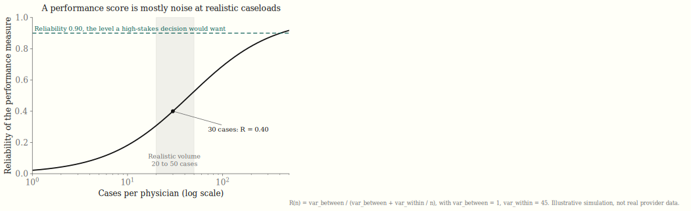
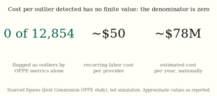

# The credential looks rigorous; the score does not separate safe from dangerous

*Physician credentialing has high face validity. Whether it has predictive validity is a separate, and statistical, question.*

Physician credentialing and privileging are built to reassure. A hospital verifies a license, confirms a board certification, reviews a work history, and then keeps watch through performance data. The apparatus has high face validity. It looks like exactly what a careful institution would do to keep a dangerous provider away from patients, and that resemblance is most of why we trust it. This piece is about a different property, predictive validity, which is whether the same apparatus actually separates a safe provider from a dangerous one. The two are not the same thing, and the distance between them is statistical, not moral or procedural.

Consider the ongoing-monitoring half of the system. The Joint Commission requires Ongoing Professional Practice Evaluation, or OPPE: performance data collected on each individual privileged provider and factored into the decision to keep, limit, or revoke privileges. The intent is sound and the data are real. The difficulty is arithmetic. A dangerous provider is a rare event. Any one physician accrues only a small number of relevant cases in a year. A rare numerator measured over a small denominator produces an estimate that is dominated by noise rather than by the quantity you wanted to measure, and no amount of administrative care around the edges changes that core.

The standard way to make this precise is the reliability of a physician-level measure, the share of the observed variation between physicians that reflects true differences rather than measurement error. Written out, it is `R(n) = var_between / (var_between + var_within / n)`. Reliability rises with genuine physician-to-physician variation and falls as measurement noise grows, and because the noise term shrinks as one over the caseload, sample size is what tips the balance. The chart below traces that curve. At realistic case volumes the measure barely lifts off the floor. With the illustrative variance values shown, a physician with thirty cases has a reliability near 0.40, and across a twenty-to-fifty-case band it stays between 0.31 and 0.53, far below any threshold one would trust for a decision about someone's privileges. The published literature lands in the same place from the other direction: in one worked case, reaching a reliability of 0.90 required between 138 and 255 cases per physician, and a modest change in risk adjustment reclassified 8 of 56 doctors across quartiles.

It helps to see what a noise-dominated measure does when you rank people with it. The cleanest way to see it is to build a world with no real differences at all and watch the ranking invent some. In the funnel plot below, every one of three hundred simulated providers shares a single true event rate of three percent. Their caseloads are drawn from a skewed distribution with a median near thirty, so most carry few cases and a few carry many, and the only thing that varies between them is luck. The control limits are computed, not sketched: they are the true rate plus or minus z times the binomial standard error, `sqrt(p0 (1 - p0) / n)`, evaluated across the range of volumes. Nearly every provider falls inside the funnel, exactly as they should, because they are in truth identical. Yet a naive worst-to-best ranking still lifts a handful above the line and labels them outliers. In this run 9 providers cross the ninety-five-percent limit despite sharing the same true rate. This is the league-table fallacy: the spread is noise, and ranking is a machine for converting noise into apparent signal.

If the ranking were measuring something real, it would hold still from one year to the next. It does not. Drawing two independent years from the identical true rate and sorting each into quartiles, 64 percent of providers land in a different quartile the second year. The slopegraph below draws that movement. Because the data were built with no true differences whatsoever, every line that changes height is pure noise. The sourced finding that a small change in risk adjustment reclassified eight of fifty-six doctors across quartiles is the same phenomenon seen in real data; the simulation shows that even more reshuffling is the default once volumes are low and you simply let the same providers play another season. The honest reading is that this churn is larger than the one-in-seven figure, not smaller, because resampling the same people at low volume is a harsher test than a single risk-adjustment tweak.

None of this is hypothetical at the level of yield. In a study spanning 12,854 providers, zero were flagged as outliers through the OPPE metrics alone, at a recurring labor cost near fifty dollars per provider, on the order of seventy-eight million dollars per year nationally. The authors describe it as possibly predominantly administrative waste. The cost per outlier detected has no finite value, because the denominator is zero. The Joint Commission itself concedes the underlying problem through its low-volume carve-out, which permits supplemental outside data when local activity is too sparse to evaluate a provider. That carve-out is an admission written in policy language that the denominators are often too small to support the inference anyone wants to draw from them.

Low yield is not zero value, and the distinction matters. A program that finds nothing through its metrics can still deter, can still catch the rare unambiguous case that no statistic was needed to see, and the entry-level work of verifying a license and screening for outright fraud does real good that has nothing to do with the reliability of a performance score. The claim worth making is narrow and worth stating plainly. Credentialing and the OPPE score have high face validity and weak predictive validity. They look like instruments that separate safe providers from dangerous ones, and at the volumes most physicians actually generate, they mostly cannot. Treating a noisy score as if it were a sharp one does more than waste money. It manufactures false confidence in both directions, flagging the unlucky and clearing no one in particular. The charts above are simulated on clearly labelled illustrative data, but the arithmetic they make visible is the same arithmetic that governs the real programs.

---

*Methods. Every simulated figure is generated by `generate_charts.py` from a single seeded NumPy generator (seed 20260620), printed on each run. Reliability follows R(n) = var_between / (var_between + var_within / n); funnel limits follow p0 +/- z*sqrt(p0(1-p0)/n); quartile churn is computed from two independent Binomial(n, p0) years. Re-running the script reproduces identical figures. The OPPE yield panel reports published figures and is not simulated. Simulated charts are illustrative and are not real provider data.*

## Sources

The non-simulated figures in this post are drawn from the literature on Ongoing Professional Practice Evaluation and physician-level performance measurement. The OPPE requirement and the low-volume carve-out are Joint Commission policy. The 12,854-provider yield, the per-provider and national cost estimates, the 138-to-255-case reliability result, and the 8-of-56 quartile reclassification are reported empirical findings. Replace the placeholders below with the exact citations before publishing; do not publish the sourced numbers without them.

- Joint Commission, Ongoing Professional Practice Evaluation (OPPE) standard and low-volume provision: [citation pending]
- OPPE yield and cost study (12,854 providers; 0 outliers; ~$50/provider; ~$78M/year): [citation pending]
- Physician-measure reliability worked case (0.90 reliability requiring 138-255 cases; 8 of 56 reclassified across quartiles under a risk-adjustment change): [citation pending]
