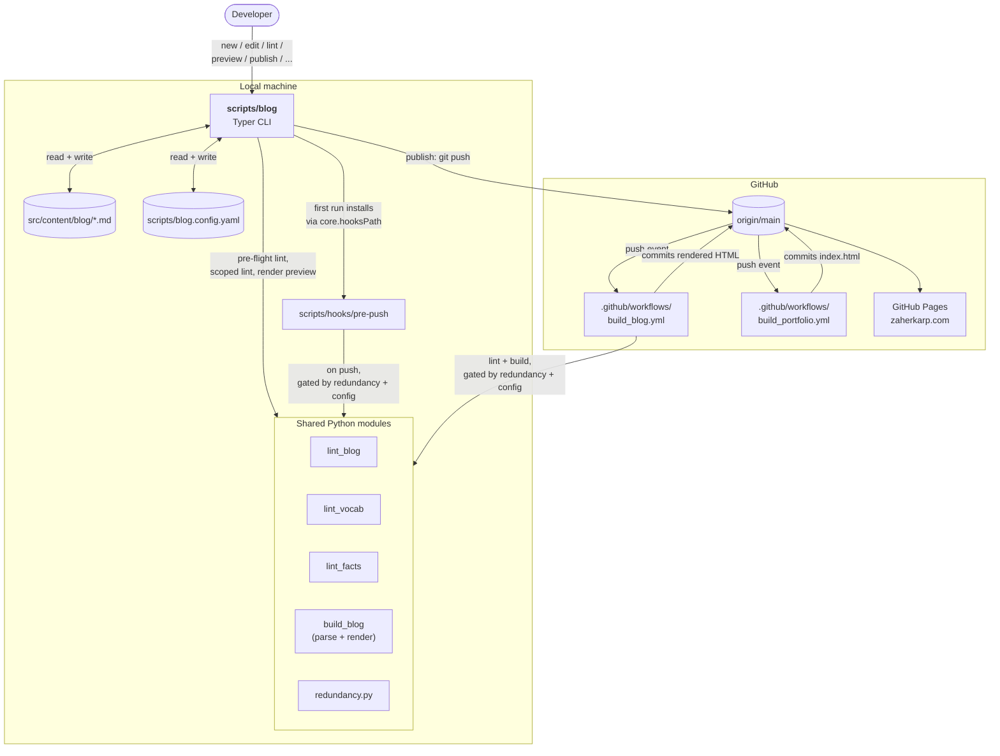

# blog — terminal companion for src/content/blog/

`scripts/blog` is a Typer-based CLI that wraps the lint + preview +
publish flow for the zaherkarp.com blog. This doc is the day-to-day
playbook. Every command in this file runs from a bash shell (including
the VS Code integrated terminal — `Terminal → New Terminal`, then pick
`bash`).

> **New to the CLI?** Start with [scripts/blog-cheatsheet.md](./blog-cheatsheet.md)
> — task-oriented ("I want to start a new post", "the push was
> rejected", etc.) with copy-pasteable commands for every common
> scenario. This file is the comprehensive playbook; the cheat sheet
> is the day-to-day reference.

> **Prefer a keyboard editor?** [scripts/edit_blog.md](./edit_blog.md)
> documents `edit_blog.py`, the terminal (curses) editor for writing
> and editing posts: a frontmatter form over a plain-text body pane,
> with lint-on-save. It pairs with this CLI — write in the TUI, lint
> and publish with `blog`.

The CLI lives at `scripts/blog` (no `.py` extension). Three valid
invocation forms:

```bash
./scripts/blog --help                     # direct, via shebang
python3 scripts/blog --help               # explicit interpreter
ln -s "$(pwd)/scripts/blog" ~/.local/bin/blog && blog --help   # symlink
```

Below, `blog` is shorthand for whichever form you prefer.

> **Every new shell session, activate the venv first** (`source
> .venv/bin/activate` from the repo root). Two things break without
> it: the `#!/usr/bin/env python3` shebang on `scripts/blog` resolves
> to whichever system `python3` is first on `PATH` — usually one that
> doesn't have `frontmatter`/`typer`/etc. installed — and the pre-push
> hook calls `python` (not `python3`), which only exists inside the
> activated venv. Symptoms: `ModuleNotFoundError: No module named
> 'frontmatter'` from the CLI, or `python: command not found` from
> the hook on `git push`.

---

## 1. Setup

### 1a. uv (recommended)

[uv](https://docs.astral.sh/uv/) is the fast, reproducible path. From
the repo root:

```bash
uv venv                                   # creates .venv/
uv pip install -r scripts/requirements.txt
source .venv/bin/activate
blog --help                               # smoke test
```

### 1b. venv + pip (fallback)

```bash
python3 -m venv .venv
.venv/bin/pip install -r scripts/requirements.txt
source .venv/bin/activate
blog --help
```

Python 3.11+ tested. Dependencies are listed in
`scripts/requirements.txt`; `rich` is pulled in transitively by `typer`.

### 1c. VS Code specifics

Set `EDITOR` to something the CLI can wait on. `blog new` and
`blog edit` shell out to `$EDITOR`; if the editor returns immediately
(VS Code's `code` does by default), the CLI moves on while you're still
typing. Pin `--wait`:

```bash
export EDITOR='code --wait'
```

Add it to your shell profile to make it stick.

### 1d. Side effects of the first run

The first invocation of any script under `scripts/` (including
`blog --help`) calls `_common.install_git_hooks()`, which sets
`core.hooksPath` to `scripts/hooks` on this repo. The pre-push hook
then runs `lint_blog`, `lint_vocab`, `lint_facts`, and the chrome
checks listed in CLAUDE.md before every push.

```bash
git config --get core.hooksPath           # inspect
git config --unset core.hooksPath         # opt out (re-installs next run)
git push --no-verify                      # one-shot bypass (not recommended)
```

The hook re-installs the next time any project script runs. To make
the opt-out durable, also remove the `install_git_hooks()` call sites,
or fork the script.

---

## 2. Daily workflow

### 2a. Start a draft

```bash
blog new                                  # interactive prompts
blog new "Title goes here"                # title from argv
blog new "Title" --no-editor              # scaffold only; don't open $EDITOR
```

Writes `src/content/blog/<slug>.md` with `draft: true`. Slug is derived
from the title; conflicts abort.

**Title gotchas — read before naming a post:**

- **Non-ASCII titles may slugify lossily.** Emoji-only titles slugify
  to `untitled`. `"café"` becomes `caf`. CJK titles produce
  `untitled` or a short Latin tail. Use an ASCII title or run
  `blog rename` after scaffolding.
- **Quotes, colons, `---`, backslashes, and Unicode all round-trip.**
  Frontmatter is built as a Python dict and emitted via
  `yaml.safe_dump`, so YAML escapes are handled correctly. If you're
  unsure, run `blog lint <slug>` immediately after `blog new` — it
  parses the file and will surface any error.

### 2b. List, find, edit

```bash
blog list                                 # all posts with draft/live state
blog list --drafts                        # drafts only
blog list --all                           # include `_`-prefixed scratch files
blog edit my-post-slug                    # open in $EDITOR
blog status                               # drafts + last 5 published + git state
```

`blog edit`, `blog lint`, `blog preview`, `blog publish`, `blog draft`,
and `blog rename` all accept a **slug fragment** — but only when the
fragment matches exactly one post file. Ambiguous fragments abort with
a list of candidates. For state-changing commands (`publish`, `draft`,
`rename`), a fragment match prompts `fragment 'X' resolved to 'Y';
proceed with that post?` before mutating, so a one-match-by-accident
won't silently rewrite the wrong file. `edit`, `lint`, and `preview`
remain unprompted because they're non-destructive.

### 2c. Lint

```bash
blog lint                                 # repo-wide: lint_blog + lint_vocab + lint_facts
blog lint my-post-slug                    # scoped to one post (skips lint_facts)
```

Scoped mode calls `lint_blog.check_post` and `lint_vocab.check_text`
in-process — no subprocess overhead. `lint_facts` is cross-surface
(resume vs homepage vs JSON-LD) so it has nothing post-scoped to say.

If `lint_facts` fails on what looks like an unrelated post, see
`scripts/lint_facts.md` for the cross-surface playbook.

### 2d. Preview

```bash
blog preview my-post-slug
```

Renders to `<tempdir>/zaherkarp-blog-preview/<slug>/index.html` and
opens the browser. `<tempdir>` is whatever `tempfile.gettempdir()`
returns: `/tmp` on Linux, `/var/folders/...` on macOS, `%TEMP%` on
Windows. Side-effect-free: no `/blog/` rebuild, no draft-flag mutation,
no commit. Asset references (`/blog.css`, `/fonts/...`) are rewritten
to `file://` URIs of the actual repo files.

**Preview omissions, by design:**

- **CDN scripts are NOT loaded** — KaTeX, Mermaid, Prism all fail in
  preview. Math, diagrams, and syntax-highlighted code render as
  unstyled markdown source.
- **Cross-page navigation won't resolve** — links to `/`, `/resume.pdf`,
  other posts, etc.

If your post has `\(...\)` or `\[...\]` math, ` ```mermaid `
fences, or any language-tagged code fences, the preview will look
broken. To render the post in full context, run the real pipeline:

```bash
python scripts/build_blog.py
python3 -m http.server 8765 &
xdg-open "http://127.0.0.1:8765/blog/$(blog list | grep my-post | awk '{print $1}')/"
kill %1
```

**Containment note.** `blog preview` rewrites any `/foo`-prefixed
asset path to a `file://` URI only if the resolved path is inside the
repo. Paths that escape the repo root (e.g. `/../../etc/hostname`) are
left as the literal string, so the browser won't fetch them.

### 2e. Publish

```bash
blog publish my-post-slug --dry-run       # show the plan, change nothing
blog publish my-post-slug                 # lint, flip draft, commit, push to main
blog publish my-post-slug -m "Custom commit message"
```

Sequence:

1. **Branch check.** Refuses from non-main branches unless
   `--force-branch` is passed. See §2f below.
2. **Pre-flight.** Runs all three legacy linters; aborts on any failure.
3. **Plan.** Prints title, slug, publishDate, and the draft transition.
4. **Confirm.** `proceed?` prompt, default No.
5. **Flip.** `draft: true` → `draft: false` on disk.
6. **Commit.** `git add <path>` and `git commit -m "Publish: <title>"`
   with a `Blog-CLI-Linted: <iso-ts>` trailer appended to the body.
7. **Push.** `git push origin main` (or `HEAD:main` from a `--force-branch`
   push; see §2f for the safety guard).

The trailer is the audit signal for the redundancy toggles (§3 below).

### 2f. Publishing from a non-main branch

```bash
blog publish my-post-slug --force-branch
```

`--force-branch` allows publishing without checking out `main` first.
The CLI now fetches `origin/main` and **refuses unless the current
branch is exactly one commit ahead** (i.e. only the publish commit).

The guard exists because `git push HEAD:main` pushes HEAD **plus every
ancestor not on origin/main**. A feature branch with five unrelated
commits would deliver six commits to production, not one. If the
guard rejects you:

```bash
git fetch origin main
git rebase origin/main
# squash or drop unrelated commits with `git rebase -i origin/main`
blog publish my-post-slug --force-branch
```

If you're already on `main`, you don't need `--force-branch` at all.

### 2g. When `git push` fails after `blog publish`

Network blip, branch protection rule, or a non-fast-forward — the
publish commit is in your local history and the post file is
`draft: false` on disk. The CLI prints a recovery hint, but for
reference:

```bash
git pull --rebase origin main
git push origin main                      # or HEAD:main if you used --force-branch
```

**Do not re-run `blog publish`.** The draft flag is already flipped,
so the CLI exits with `nothing to commit`.

### 2h. Unpublish (revert to draft)

```bash
blog draft my-post-slug
```

Flips `draft: true` on disk. **This does NOT commit or push.** The
post stays live on production until the change reaches `main`. The
full takedown is:

```bash
blog draft my-post-slug
git add src/content/blog/my-post-slug.md
git commit -m "Drop: <title> back to draft"
git push origin main
```

(There is intentionally no `blog draft --push`. Un-publishing usually
wants human review of the surrounding context — what links broke,
whether the post needs a redirect stub, etc.)

### 2i. Rename

```bash
blog rename old-slug new-slug
```

Renames `src/content/blog/old-slug.md` → `new-slug.md`. **The CLI
does NOT update inbound references.** Specifically not updated:

- The rendered `/blog/old-slug/` directory under `blog/` (will become
  stale on the next `build_blog.py` run, but the old URL still 404s)
- `sitemap.xml`
- In-prose links from other blog posts to `/blog/old-slug/`
- `homepageMarginnote` fields referencing the old slug
- Anything in `index.html` referencing the old slug

After renaming, sweep:

```bash
grep -rn old-slug index.html src/content/blog/ blog/ sitemap.xml
```

`build_portfolio.py` regenerates the homepage Writing list from
frontmatter, so it heals on the next CI run. In-prose links and
external inbound links won't.

---

## 3. Redundancy toggles

The CLI's `publish` runs all three linters as a pre-flight gate. The
pre-push hook and `build_blog.yml` CI workflow run the same linters
again by default. You can opt into trusting the CLI:

```bash
blog config show
blog config set prepush_lint skip         # pre-push hook
blog config set ci_blog_lint  skip        # build_blog.yml lint steps
blog config set prepush_lint always       # restore default (legacy stays active)
```

Stored in `scripts/blog.config.yaml` (committed). The defaults are all
`always`, so a fresh clone is not in any bypass state until you opt in.

### 3a. How detection works

`blog publish` writes a commit trailer:

```
Publish: My Post Title

Blog-CLI-Linted: 2026-05-13T08:42:01+00:00
```

The pre-push hook and CI step both call `scripts/redundancy.py`. It
walks every commit in the push range (`git rev-list origin/main..HEAD`
for the hook; `${{ github.event.before }}..${{ github.event.after }}`
for CI) and short-circuits the legacy lint runs **only when every
commit in every range carries the trailer**. Untrailered commits,
shallow clones, new-branch pushes (zero-sha base), ref deletions, and
unresolvable ranges all fall back to "run lints" — the safe default.

### 3b. The trailer is honor-system

Anyone with commit rights can hand-author `Blog-CLI-Linted: <anything>`
in a commit message and bypass the legacy linters **after** flipping
the toggle to `skip`. There is no signature, no HMAC, no verification
that `blog publish` actually ran. For a single-author repo this is an
accepted trade-off; if multiple authors land, either keep the toggles
on `always` or upgrade `redundancy.py` to verify a signed trailer.

### 3c. `ci_portfolio_lint` is reserved

`build_portfolio.yml` runs no linters today, so `ci_portfolio_lint` is
a no-op toggle. The config key is wired in `redundancy.py` so adding a
linter to that workflow later is a one-line `if:` gate. Setting it
today is harmless.

---

## 4. Quick reference

```bash
# First-time setup
uv venv && uv pip install -r scripts/requirements.txt
source .venv/bin/activate
export EDITOR='code --wait'               # for VS Code users

# Day-to-day
blog new "My Post Title"
blog list --drafts
blog edit my-post-title
blog lint my-post-title
blog preview my-post-title
blog publish my-post-title --dry-run
blog publish my-post-title

# Less common
blog status
blog rename old-slug new-slug
blog draft my-post-title
blog config show

# Audit / inspect
git config --get core.hooksPath
python3 scripts/redundancy.py prepush_lint   # exit 0 = skip, 1 = run
git log -1 --format=%B HEAD                  # see the trailer on the last commit
```

---

## 5. Known risks and footguns

A combined security + red-team review of this CLI flagged the items
below. The P0 and most P1/P2 items are now patched; the remaining
unpatched entries are accepted behavior with a documented mitigation.

| # | Severity | Issue | Status |
|---|---|---|---|
| 1 | P0 | `--force-branch` pushing all ahead commits to main | **Patched.** `publish` fetches `origin/main` and refuses unless exactly one commit is ahead |
| 2 | P1 | `find_post` accepted `..` segments in direct-path matches; `rename ../resume foo` could move `src/content/resume.md` into the blog dir | **Patched.** `find_post` now rejects any candidate resolving outside `POSTS_DIR` |
| 3 | P1 | `blog preview` resolved arbitrary `file://` asset paths (a draft with `` could read local files in the browser) | **Patched.** Asset-rewrite verifies `is_relative_to(ROOT)` before emitting the `file://` URI |
| 4 | P1 | Backslash in `blog new` title produced unparseable YAML (`C:\Users` → ScannerError on load) | **Patched.** Frontmatter is now built as a dict and emitted via `yaml.safe_dump`; backslashes, quotes, colons, and Unicode round-trip correctly |
| 5 | P1 | `blog draft` does not commit/push | **By design** (un-publish wants human review of surrounding context). See §2h for the manual commit + push sequence |
| 6 | P2 | Slug-fragment one-match-by-accident not confirmed | **Patched.** `publish`, `draft`, and `rename` now prompt before mutating when the slug resolved via fragment match; `edit`, `lint`, `preview` remain unprompted (non-destructive) |
| 7 | P2 | `blog rename` does not update inbound references despite the module-docstring claim | **Partially patched.** Docstring now says "does not update inbound /blog/&lt;old-slug&gt;/ references"; the manual sweep in §2i is still required |
| 8 | P2 | Hooks auto-install on `--help` | **Accepted.** The auto-install is intentional and idempotent; opt-out documented in §1d |
| 9 | P2 | `blog status` showed stale `commits_ahead` if `origin/main` was not fetched | **Patched.** `commits_ahead` accepts a `fetch=True` flag and `status` passes it. The "fetched origin/main" notice prints unconditionally — the underlying fetch swallows offline / missing-remote errors, so the count falls back to whatever ref is local without surfacing the failure |
| 10 | P2 | Hand-edited `blog.config.yaml` with a non-dict `redundancy:` value crashed `blog config show` with `AttributeError` | **Patched.** `redundancy.toggle_value` now `isinstance`-guards the section and falls back to "always" |

Also fixed in the same pass:

- Module docstring at the top of `scripts/blog` now lists all ten
  subcommands and is honest about `rename` and `preview` semantics.
- `scripts/requirements.txt` now pins `rich>=13.0` explicitly so the
  CLI keeps working if a future `typer` release drops it.
- Empty `tags:` input to `blog new` now produces `tags: []` (an empty
  list) rather than `[None]`.

---

## 6. Architecture



The architectural point: **the same five Python modules are reused at
three layers** — the CLI's pre-flight, the pre-push hook, and the CI
workflow. The "Shared Python modules" subgraph is the contract; the
three callers (CLI, hook, CI) all reach into it. `redundancy.py` plus
`blog.config.yaml` is the toggle plane that lets the hook and CI
short-circuit when the CLI already linted (see §3).

`build_blog.parse_post` / `render_post` are imported in-process by
`blog preview` so the preview path doesn't shell out to a second
Python; the same functions are also called by `build_blog.py` from
inside the `build_blog.yml` workflow. `build_portfolio.yml` runs
`build_portfolio.py` directly (no shared-module call out of `blog`
into it today, hence no arrow from CI2 into the Shared box).

---

## 7. Reference: file map

| Path | Purpose |
|---|---|
| `scripts/blog` | The CLI (Typer-based, ~910 lines) |
| `scripts/blog.config.yaml` | Redundancy-toggle storage |
| `scripts/redundancy.py` | Shared toggle checker; called by hook + CI |
| `scripts/hooks/pre-push` | Bash hook installed via `core.hooksPath` |
| `scripts/_common.py` | Auto-installs the pre-push hook on first script run |
| `scripts/lint_blog.py` | Per-post + repo-wide markdown lint |
| `scripts/lint_vocab.py` | Per-post + repo-wide CMS/HEDIS vocab lint |
| `scripts/lint_facts.py` | Cross-surface resume / homepage / JSON-LD lint |
| `scripts/build_blog.py` | Static-site build; `parse_post` / `render_post` reused by `blog preview` |
| `.github/workflows/build_blog.yml` | CI build + lint, gated by `ci_blog_lint` toggle |
| `.github/workflows/build_portfolio.yml` | CI homepage refresh (no lint gating today) |
| `src/content/blog/*.md` | Blog post sources (frontmatter + markdown) |
