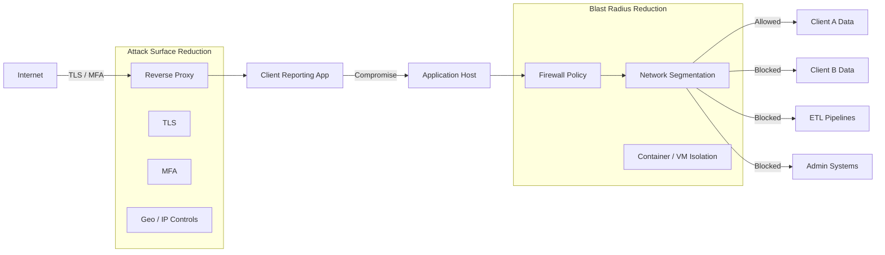

# Security Starts With the Problem You’re Trying to Solve  
*A healthcare analytics vendor perspective*

In healthcare analytics, security conversations often jump straight to controls.

Network segmentation. VPNs. Private subnets. Reverse proxies. Zero trust.  
All important. None of them are the starting point.

The starting point is always the same question:

**What problem are we actually trying to solve?**

In our world, that problem is usually some combination of:
- Protecting PHI
- Preserving customer trust
- Meeting contractual and regulatory obligations
- Limiting operational and reputational damage when something goes wrong

Security is not about eliminating risk. It’s about **managing failure responsibly**.

## Prevention vs Containment (and Why Healthcare Needs Both)

At a high level, security work falls into two buckets:

1. **Reducing the likelihood of compromise**  
2. **Reducing the impact of compromise**

These get blurred constantly, but they solve different problems.

You can have excellent perimeter controls and still fail catastrophically if a compromised system can freely move laterally through your environment. In healthcare analytics, that lateral movement often means crossing boundaries you *really* care about: contracts, clients, and regulated data.

So instead of asking:
- “Do we need VLANs?”
- “Is a VPN enough?”
- “Should this be private or public?”

The better question is:

**If this component is compromised, what else can it reach?**

## Risk Acceptance Is Architecture (Especially for Vendors)

Every architecture embeds a risk decision.

As a healthcare analytics vendor, those decisions often look like this:
- Multiple payer clients
- Shared analytics platforms
- Mixed workloads (ETL, reporting, admin tooling)
- Varying levels of PHI sensitivity

It’s common to rely on:
- Reverse proxies to expose limited services
- TLS everywhere
- MFA for access
- Container or VM isolation
- Cloud-native firewall rules

All of that is good practice.

But none of it answers the most important downstream question:

**Does a compromise in one client context increase risk for another?**

If the answer is “yes,” then you’ve accepted cross-client blast radius, whether you intended to or not.

## Where Network Segmentation Fits for Healthcare Analytics

Network segmentation (VPCs, subnets, VLANs, security groups) is not inherently “more secure.”

It becomes meaningful **when combined with policy enforcement** that limits communication paths.

In a healthcare analytics context, segmentation is typically used to enforce boundaries like:
- Client A data cannot reach Client B workloads
- ETL infrastructure cannot directly access reporting UIs
- Admin tooling cannot see raw PHI by default
- Vendor internal systems are isolated from client-facing services

This isn’t theoretical. This is how you make statements like:
> “A compromise of this reporting service cannot access raw claims data.”

That statement only becomes true when the network enforces it.

## An Example in Healthcare: Reporting UI Compromise

Imagine a vendor-hosted reporting application:
- Internet-facing
- Protected by TLS, MFA, and a reverse proxy
- Used by multiple payer clients

Now assume that application is compromised via:
- A dependency vulnerability
- An application logic flaw
- Credential reuse

The key question is **not** “Why did this happen?”

The key question is:

**What can that compromised service reach next?**

If it can:
- Query raw claims tables
- Reach ETL pipelines
- Access admin services
- Discover other client environments

Then the blast radius is no longer limited to one app. It’s systemic.

Segmentation plus firewall policy is how you turn a breach into:
- A contained incident
- A narrow disclosure analysis
- A survivable compliance event

---

## VPNs, Private Access, and False Comfort

Many vendors rely heavily on VPNs or private access layers and feel comfortable skipping deeper segmentation.

That can be reasonable, but it’s still a risk decision.

VPNs answer:
> “Who is allowed to connect?”

They do **not** answer:
> “What can a compromised system reach once connected?”

“No known vulnerabilities” in VPN protocols is not a guarantee. It’s an assumption. Assumptions are fine, as long as they’re explicit and revisited.

---

## Security Layers Solve Different Healthcare Problems

Each security layer addresses a specific failure mode:

- Reverse proxy: limits exposed endpoints
- TLS: protects PHI in transit
- MFA: protects credentials
- Geo / IP controls: reduce opportunistic attacks
- VPN / private access: restrict entry points
- Network segmentation + firewall policy: limit blast radius
- Separate client environments: protect contractual boundaries

None of these replace the others. And none are universally required.

They answer **different questions**.

---

## Visualizing Attack Surface vs Blast Radius (Healthcare Context)

