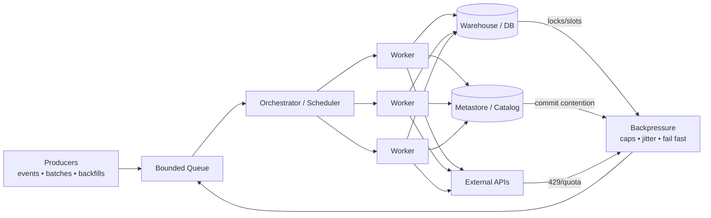

# Concurrency: The Story We Tell vs. the System We Run

Most people *say* concurrency and mean **parallelism**: more workers, more threads, more partitions, more speed.

Production hears “more” and replies: **shared resources, contention, queues, retries, and somebody waiting**.

Concurrency in practice is not “how many things can run.”
It’s **which things are allowed to make progress when everything is busy**.

## The perception gap

What we imagine:
- Work fans out cleanly
- Tasks are independent
- Scaling is a knob

What we deploy:
- Shared sinks (DB/warehouse), shared metadata, shared network
- Skew (one partition or key is a black hole)
- Retries that multiply load
- Backfills that collide with “today’s run”

## A realistic data pipeline view

If you’re “scaling” without **bounded queues + per-sink concurrency caps + sane retry policy**, you’re usually just speeding up your failure mode.

## What changes in healthcare analytics

Same concurrency mechanics, higher stakes:

- **Auditability**: you must prove what inputs produced what outputs
- **Reproducibility**: reruns must match or you lose trust
- **Late/corrected files**: backfills are normal, not special
- **Regulatory timelines**: “late” is a business event

So the goal isn’t max throughput. It’s **predictable truth**.

## The only definition that consistently helps

Concurrency is **shared progress under contention**.

Ask these instead of “how many workers”:
- What resource is actually shared (DB slots, table locks, API quota, metastore commits)?
- Where do we serialize without admitting it?
- What happens when retries stack up?
- Where is backpressure applied, and does it work under stress?
