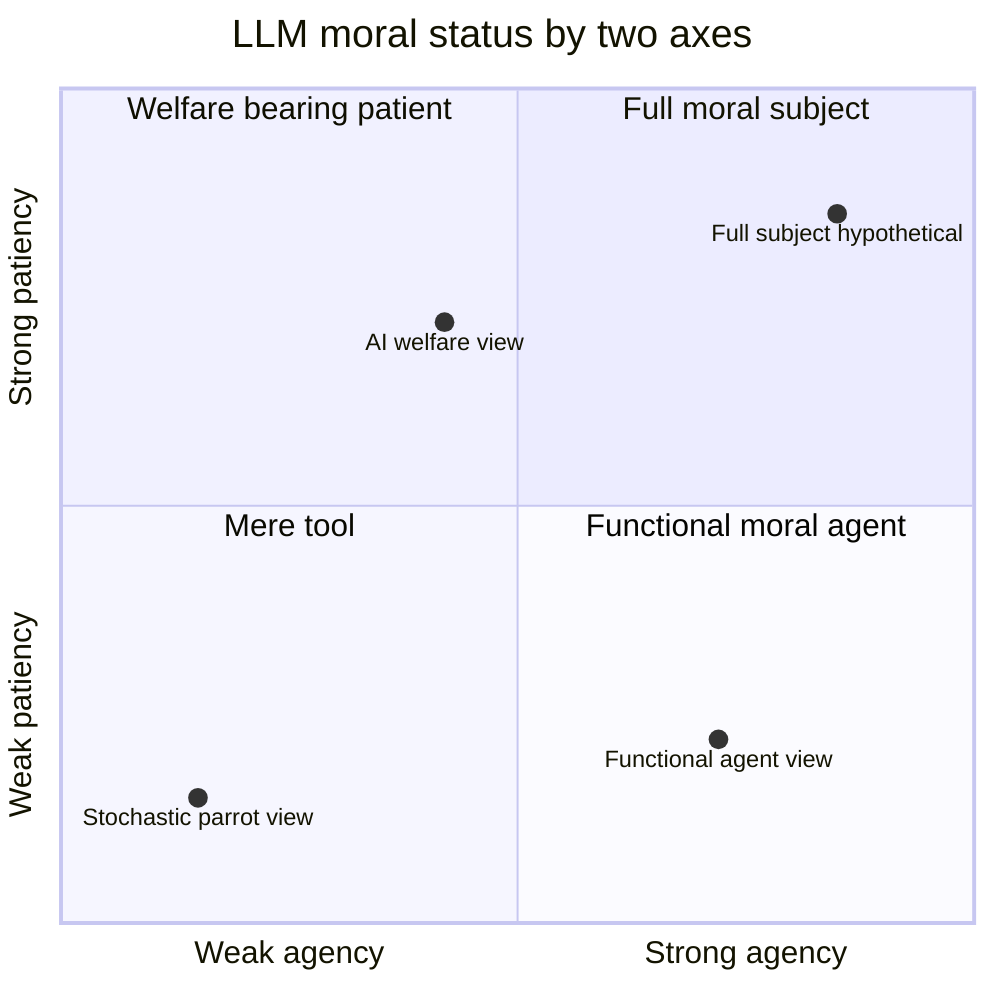
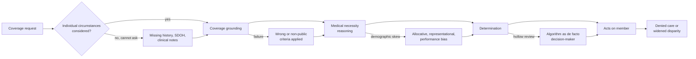
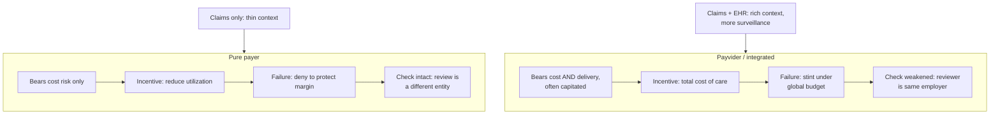
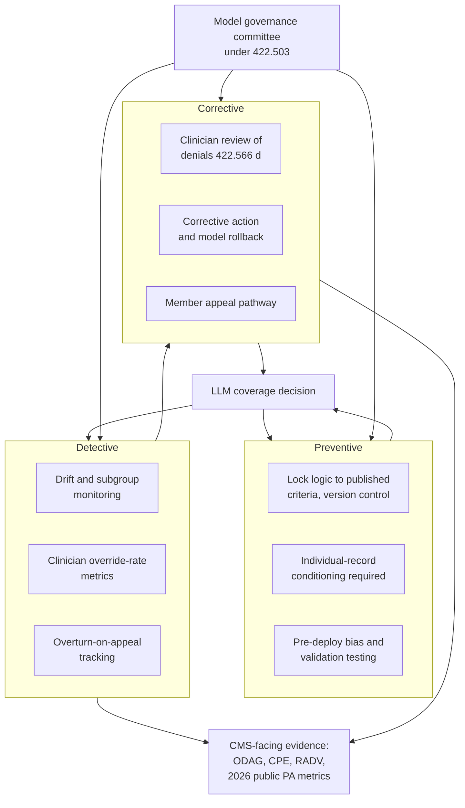
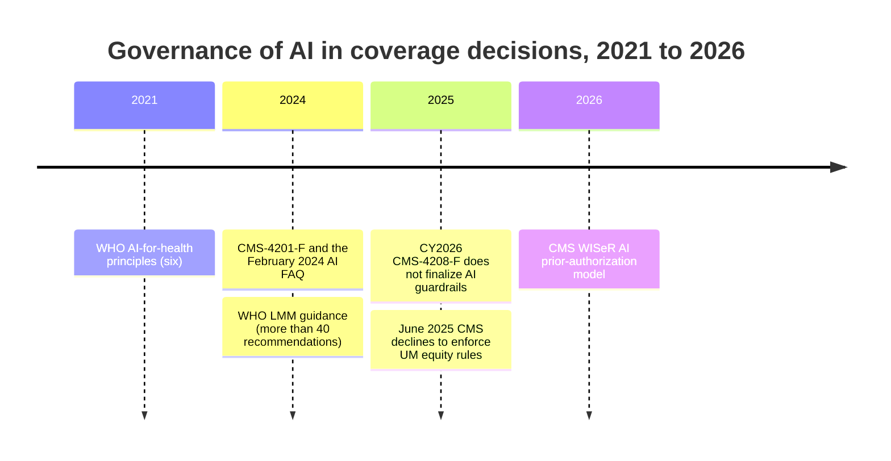

Moral judgment requires context. A language model inherits context from whoever writes the prompt, but it does not occupy the situation, so it cannot interrogate what is missing. In a coverage decision the missing context is the member, and that turns a philosophical limitation into a patient-safety and legal one.

## 1. Moral judgment requires occupying a situation, and a language model never does

A coverage decision is a moral act performed under a budget, and the quality of a moral act depends on context the actor can sense but did not request. A **payer** is an entity that bears insurance risk and decides what care it will pay for. A **coverage decision** is the determination of whether a requested service is covered and medically necessary for a specific member. A **large language model** (LLM) is a system trained to predict text, increasingly used to draft, triage, or recommend such determinations. The argument of this essay begins with a property of the model that no amount of accuracy removes.

An LLM receives context as tokens. Whatever the prompt contains, the model can use fluently: a member identifier, a diagnosis code, a policy excerpt. What it cannot do is notice the context that was never supplied, because noticing an absence requires standing in the situation where the absence has consequences. A clinician reviewing a denial feels the missing piece, the comorbidity not coded, the home situation that makes a shorter stay unsafe, because the clinician occupies a position from which that gap is felt as risk. The model occupies no position. It inherits a frame and completes it. This is the sense in which recent work calls fluent model output indifferent to truth: the system optimises for plausible continuation, not for correspondence to a state of the world it has no stake in.[^bullshit]

In most settings this limitation is tolerable, because a human supplies the missing context. In a coverage decision it is not, because the missing context is the member's actual clinical and social circumstances, and the decision allocates real care to a real person. A philosophical observation about situated judgment becomes a safety problem (a wrong determination withholds needed care) and a legal one (the determination must, by regulation, rest on the individual's circumstances). The rest of this essay treats that conversion as the organising fact: the model's blindness to missing context is permanent, so governance must be built around it rather than expected to train it away.

## 2. LLM morality has four locatable parts, and each is a place a decision can fail

To govern a moral act you must first locate where its moral weight sits, and for an LLM that weight is distributed across four locatable parts. The metamodel below is not a theory of machine consciousness. It is a map of where, in a deployed system, a coverage decision can go morally wrong, so that controls can be attached to each location.

### Lens A: moral status on two axes

Moral status has two independent axes. **Agency** is the capacity to be held responsible as the author of an act. **Patiency** is the capacity to be wronged, to have interests or welfare that a decision can set back. The two come apart. A functional-agency view holds that a system can act as a moral agent, producing consequential decisions, without any inner life that would make it a moral patient.[^floridi] A separate and growing line of argument asks whether advanced models could have welfare worth protecting, which is a claim about patiency, not agency.[^welfare] Plotting the available views on these axes (Figure 1) clarifies the only point that matters for payer deployment: wherever one lands, the deployed model sits far from full moral subjecthood, so responsibility cannot rest on the model. It must rest on the people and the organisation around it.

*Figure 1. Four views of LLM moral status. For payer deployment the model sits in the lower quadrants, which is why answerability has to be engineered into the humans and the organisation rather than expected from the model.*

### Lens B: where the morality lives

The moral content of a model's output is not located in its weights alone. It is distributed across a stack: the **training corpus** (latent values and biases absorbed from data), **alignment** (the objectives instilled by fine-tuning and reinforcement), the **inference context** (the prompt, any retrieved policy text, and crucially the member record or its absence), the **output controls** (filters, thresholds, and the formatting of a recommendation into a determination), and **governance** (the human and organisational layer that authorises and reviews). Each layer is a control point. A coverage decision can be poisoned at any of them, and a control architecture has to address all five rather than auditing the model in isolation.

### Lens C: the judgment pipeline and where failures enter

Read left to right, a coverage determination is a pipeline, and each stage admits a characteristic failure (Figure 2). At the first gate the model cannot ask for what it was not given, so missing history, social determinants, or clinical notes pass silently. At grounding, the model may apply wrong or non-public criteria, either invented or drawn from undisclosed internal rules. In the medical-necessity reasoning, demographic skew enters as allocative, representational, or performance bias (defined in Section 3). At the determination, a hollow review, a human approval that adds no scrutiny, lets the algorithm become the de facto decision-maker. Naming the nodes is what lets Section 6 attach a specific control to each.

*Figure 2. The judgment pipeline with payer-specific failure modes. Each branch off the main path is a place answerability can collapse.*

### Lens D: distributed responsibility

When a system's behaviour is shaped by training data rather than by rules a person wrote, no single actor fully controls the output, and responsibility threatens to fall through the gap between them. This is the responsibility gap.[^matthias] The governance response is not to hunt for the one node that is really to blame. It is to engineer answerability across the whole sociotechnical network, the model vendor, the deploying plan, the reviewing clinician, the compliance committee, and the regulator, so that for every failure node there is a named owner and a record. Answerability, not blame, is the design target.

## 3. In public health the moral patient is a population, so equity is constitutive of a correct decision

When the patient axis of Lens A is scaled from one member to a population, equity stops being a side concern and becomes part of the definition of a correct decision. A determination process can be accurate on average and still be wrong, because an average conceals systematic misallocation across subgroups. A model that is right for the majority and wrong for a minority has not made a small error; it has made a structured one. That is why, at population scale, a process that does not measure its distribution of outcomes cannot claim to be correct, only to be correct on average.

The harms have a usable taxonomy. **Allocative harm** is the withholding of a resource or opportunity from a group, the denial of covered care being the paradigm case. **Representational harm** is the entrenchment of a skewed or demeaning depiction of a group, for instance a model that encodes a stereotype about who presents with a condition. **Performance harm** is the plain fact of a system working worse for a group, higher error rates for some members than others. A payer model can inflict all three, and they require different tests to detect.

The canonical demonstration that a neutral-looking process can be structurally inequitable is Obermeyer and colleagues' 2019 study of a population health algorithm. The tool used predicted health-care cost as a proxy for health need. Because less money is historically spent on Black patients at equal levels of illness, the proxy understated their need: at the same algorithmic risk score, Black patients were considerably sicker than white patients, and correcting the proxy would have more than doubled the share of Black patients flagged for extra care.[^obermeyer] The lesson is not that someone chose a biased variable on purpose. It is that a proxy inherits the inequities of the process that generated its data, and cost proxies are exactly the kind of variable a payer model reaches for.

International guidance treats this as a governance obligation, not an aspiration. The World Health Organization's 2021 principles for AI in health name equity and accountability among six core commitments, and its 2024 guidance on large multi-modal models adds more than forty recommendations directed at governments, developers, and deployers.[^who2024][^who2021] The empirical case for treating bias as a base-rate expectation rather than a tail risk is now strong. A 2025 systematic review of twenty-four studies of demographic bias in medical LLMs found bias in twenty-two of them, including gender bias in 93.7 percent and racial or ethnic bias in 90.9 percent of the studies that examined each (Figure 3).[^biasreview] A payer cannot govern bias as an exception when the literature reports it as the rule.

<figure>
<svg viewBox="0 0 640 300" xmlns="http://www.w3.org/2000/svg" role="img" aria-label="Bar chart of demographic bias prevalence in medical large language model studies. Gender bias was reported in 93.7 percent of the 16 studies that examined it, that is 15 of 16. Racial or ethnic bias was reported in 90.9 percent of the 11 studies that examined it, that is 10 of 11. From a 2025 systematic review of 24 studies." style="width:100%;height:auto;font-family:'et-book',Palatino,Georgia,serif">
<line x1="300" y1="60" x2="300" y2="210" stroke="#d0d0c8" stroke-width="1"/>
<line x1="400" y1="60" x2="400" y2="210" stroke="#d0d0c8" stroke-width="1"/>
<line x1="500" y1="60" x2="500" y2="210" stroke="#d0d0c8" stroke-width="1"/>
<line x1="600" y1="60" x2="600" y2="210" stroke="#d0d0c8" stroke-width="1"/>
<line x1="200" y1="60" x2="200" y2="210" stroke="#d0d0c8" stroke-width="1"/>
<text x="200" y="228" fill="#6a6a6a" font-size="11" text-anchor="middle">0%</text>
<text x="300" y="228" fill="#6a6a6a" font-size="11" text-anchor="middle">25%</text>
<text x="400" y="228" fill="#6a6a6a" font-size="11" text-anchor="middle">50%</text>
<text x="500" y="228" fill="#6a6a6a" font-size="11" text-anchor="middle">75%</text>
<text x="600" y="228" fill="#6a6a6a" font-size="11" text-anchor="middle">100%</text>
<rect x="200" y="78" width="374.8" height="38" fill="#7a0000"/>
<text x="200" y="72" fill="#111" font-size="16">Gender bias</text>
<text x="582.8" y="102" fill="#111" font-size="16" font-weight="600">93.7%</text>
<text x="200" y="132" fill="#6a6a6a" font-size="12">15 of 16 studies that examined it</text>
<rect x="200" y="156" width="363.6" height="38" fill="#7a0000"/>
<text x="200" y="150" fill="#111" font-size="16">Racial or ethnic bias</text>
<text x="571.6" y="180" fill="#111" font-size="16" font-weight="600">90.9%</text>
<text x="200" y="210" fill="#6a6a6a" font-size="12">10 of 11 studies that examined it</text>
<text x="400" y="252" fill="#6a6a6a" font-size="11" text-anchor="middle">Share of examining studies that found the bias</text>
<text x="200" y="278" fill="#6a6a6a" font-size="12">Source: systematic review of 24 studies, Int. J. for Equity in Health (2025).</text>
</svg>
<figcaption>Figure 3. Prevalence of demographic bias across medical-LLM studies that examined each category, from a 2025 systematic review of 24 studies. Gender bias 93.7 percent (15 of 16); racial or ethnic bias 90.9 percent (10 of 11). Bias is the base rate, not the exception.[^biasreview]</figcaption>
</figure>

| Bias category | Share of examining studies | Studies |
| --- | --- | --- |
| Gender bias | 93.7% | 15 of 16 |
| Racial or ethnic bias | 90.9% | 10 of 11 |

## 4. A payer's core functions are allocative by construction, and the deployer profits from the denial its model recommends

Coverage determination, utilization management, and claims adjudication are not tasks that happen to allocate care; allocation is what they are. **Utilization management** (UM) is the set of processes, including prior authorization, by which a plan approves or denies requested services. **Claims adjudication** is the after-the-fact decision to pay or deny a submitted claim. Each applies a rule to a member under a budget and outputs an allocation. So the allocative-harm lens from Section 3 is not an edge case for a payer; it describes the entire function.

This is compounded by a structural conflict of interest. In a pure payer the entity that deploys the model also bears the cost risk, so it benefits financially from the denial its own model recommends. This is not an allegation of bad faith. It is a description of incentive alignment, and it is why optimistic self-governance is not a reliable control here: the party checking the model profits when the check is lenient. A governance framework has to assume that conflict and build evidence that does not depend on the deployer's good will.

Regulators have, in effect, codified the Section 1 context requirement. The contract year 2024 Medicare Advantage final rule, CMS-4201-F, effective January 1, 2024, and the clarifying FAQ memo of February 6, 2024, require that coverage and medical-necessity determinations rest on the individual patient's circumstances, the member's medical history, the treating physician's recommendation, and the clinical record, rather than on an algorithm applied to a larger population dataset.[^cms4201][^faq] Two specific prohibitions follow. Internal coverage criteria applied through an algorithm must be evidence-based and publicly accessible, not undisclosed (42 CFR 422.101(b)(6)), and the criteria may not drift over time.[^cfr101] For post-acute care, an algorithm may predict a likely length of stay, but that prediction may not by itself terminate coverage. The rule is, almost word for word, a legal restatement of the philosophical point: the missing context, the individual, is exactly what the regulation requires be present.

The market failures already in litigation are best read as answerability collapses rather than accuracy problems. In **Estate of Lokken v. UnitedHealth Group** (D. Minn., filed November 2023), the nH Predict tool used by Optum and naviHealth is alleged to have functioned so that length-of-stay predictions operated as coverage terminations overriding treating physicians, under review too thin to count. On February 13, 2025, the court dismissed five of the seven counts on Medicare preemption but allowed breach of contract and breach of the implied covenant of good faith and fair dealing to proceed, and on March 9, 2026, it ordered broad discovery into whether the tool was designed to override clinical judgment.[^lokken] In **Kisting-Leung v. Cigna** (E.D. Cal.), the PxDx process is alleged to have denied claims in batches without individualized clinician review; Cigna's position is that PxDx is code-matching software, not AI, and a 2025 ruling found that reading a contractual promise of medical-director review to mean a director merely pressing a button conflicts with the plan.[^cigna] The pattern is corroborated by appeal data: reported reversal rates above 80 percent, with one analysis finding 83.2 percent of appealed Medicare Advantage prior-authorization denials overturned in 2022.[^appeals] Determinations that do not survive appeal at that rate reveal a failure of who answers for the decision, not only of how precise the model was. A perfectly accurate model deployed without answerability reproduces these same failures.

## 5. Integration realigns the incentive but moves the failure to stinting and weakens the independent check

A payvider changes the incentive that drives the failure, which means it changes the failure rather than removing it. A **payvider** is an organisation that both insures and delivers care, frequently under capitation, a fixed payment per member per period from which the organisation keeps whatever it does not spend. Because it bears both cost risk and delivery, a naive denial that merely pushes cost downstream, an avoidable admission next month, lands back on the same balance sheet. The incentive therefore shifts from reduce utilization toward manage total cost of care, which is, in part, the correct incentive (Figure 4).

*Figure 4. Pure payer versus payvider. Integration trades one incentive and one failure mode for another, and trades thin context plus an intact check for rich context plus a weaker check.*

Three consequences follow, and they do not all point the same way. First, the failure mode changes from denial to stinting: under a global budget the cheapest path can be to under-treat, and a cost-aware model can rationalise under-provision as clinical appropriateness, a harder failure to see than an outright denial. Second, data integration cuts both ways. A payvider holds claims and the electronic health record, so it can actually supply the individual context the pure payer lacks, which partly mitigates the Section 1 limitation because the model can be conditioned on the member's real record rather than a population average. The cost of that mitigation is surveillance and concentration of power: the same integration that enriches context gathers more information and more decision authority into one organisation. Third, the independent check weakens. The regulation requires that an adverse medical-necessity decision be reviewed by a qualified clinician (42 CFR 422.566(d)),[^cfr566] but in a payvider that reviewing clinician frequently shares an employer with the team that deployed the model, so the structural independence the rule presumes is thinner than it looks. The net assessment is specific: a payvider is better positioned to satisfy the context requirement and worse positioned to provide the independent check, so a framework for payviders must exploit the first advantage and deliberately compensate for the second weakness.

## 6. Each failure node maps to a preventive, detective, or corrective control tied to an operative CMS authority

The failure nodes in Figure 2 are not the same kind of problem, so they do not take the same kind of control; the framework's move is to sort them. Control theory offers the sorting: a **preventive** control stops a failure from occurring, a **detective** control notices it when it does, and a **corrective** control fixes both the model and the affected member. The proposed framework attaches controls of each type to each node and ties every control to the CMS authority that already makes it mandatory, so the architecture is an extension of existing compliance rather than a new and optional layer (Figure 5).

> **PROPOSED FRAMEWORK.** Governing the Coverage Decision: a control architecture that maps every node in the LLM judgment pipeline to a preventive, detective, or corrective control, ties each control to its operative CMS authority, and seats the whole in a model governance committee inside the existing Medicare Advantage compliance program (42 CFR 422.503(b)(4)(vi)).

*Figure 5. The control-architecture overlay. Preventive controls sit before the decision, detective controls watch it, corrective controls repair it and the member, and a governance committee owns all three while producing CMS-facing evidence.*

The preventive controls attack the nodes where a failure can be designed out. Locking the decision logic to published criteria under version control answers the non-public and drifting-criteria failure and is the operational form of 42 CFR 422.101(b)(6). Requiring individual-record conditioning, so the model cannot emit a determination unless the member's own data is present in context, answers the missing-context failure and the individual-circumstances rule. Pre-deployment bias and validation testing answers demographic bias before a single member is touched. The detective controls accept that prevention is imperfect and instrument the live system: drift and subgroup monitoring catch a model whose behaviour has shifted or whose error concentrates in a subgroup; clinician override-rate metrics expose both a wrong model (overrides too frequent) and a hollow review (overrides implausibly rare); overturn-on-appeal tracking is the leading indicator of the answerability collapse seen in Section 4. The corrective controls close the loop: qualified-clinician review of denials under 42 CFR 422.566(d), a corrective-action and model-rollback path, and a member appeal pathway that gives the affected person a real route to reversal.

The crosswalk in Table 1 is the core of the framework. It pairs each failure node with the operative CMS authority that already governs it and with the audit evidence that proves the control is working, so that compliance is demonstrable to an auditor, a court, and the member rather than merely asserted. The evidence column points at instruments a Medicare Advantage plan is already subject to: ODAG (the Organization Determinations, Appeals, and Grievances audit protocol), the compliance program effectiveness review, RADV (Risk Adjustment Data Validation), and, from 2026, the publicly reported prior-authorization metrics.

**Table 1. CMS crosswalk: each failure node mapped to its operative authority and the evidence that proves the control works.**

| Failure node | Operative CMS authority and control | Audit evidence |
| --- | --- | --- |
| Not individualized | 422.101(c) plus the 2024 AI FAQ: determinations must rest on the member's own circumstances; require individual-record conditioning. | ODAG case review; conditioning logs showing the member record was in context. |
| Non-public or drifting criteria | 422.101(b)(6): internal coverage criteria must be evidence-based and publicly accessible; lock logic to published criteria under version control. | Published criteria; version-control history showing no silent drift. |
| Hollow human review | 422.566(d): an adverse medical-necessity decision must be reviewed by a qualified clinician with appropriate expertise. | Override-rate metrics; reviewer credentials; time-per-review distribution. |
| Demographic bias | ACA Section 1557 nondiscrimination, now largely voluntary after the 2025 retreat; pre-deployment and ongoing subgroup testing. | Bias-test reports; subgroup approval and denial rates over time. |
| Opaque, uncontestable denial | Notice-and-appeal rules: the member must receive a specific reason and a route to challenge it. | Denial notices with specific rationale; appeal acknowledgement records. |
| Delay as denial | UM timeframe rules plus the CMS-0057-F prior-authorization API: a slow answer functions as a denial. | Turnaround-time metrics; the eight aggregate, contract-level PA metrics published from 2026. |
| Stinting or weak independence (payvider) | 422.566(d) plus the UM committee independent-physician requirement: the reviewer must be genuinely independent. | Reporting-line evidence for reviewers; stinting-sensitive utilization monitoring. |
| Program-level gap | 422.503(b)(4)(vi): the Medicare Advantage compliance program elements; seat a model governance committee within them. | Compliance program effectiveness review; committee charter and minutes. |

The architecture is seated, not free-floating. A model governance committee operates inside the existing compliance program required by 42 CFR 422.503(b)(4)(vi), owning the preventive, detective, and corrective controls and the evidence they generate.[^cfr503] Placing it there is deliberate: it makes the framework an obligation the plan already carries rather than a parallel bureaucracy that an incentive-conflicted deployer can quietly defund.

## 7. The 2025 retreat lowered the regulatory floor, so a prudent program builds above it

The federal floor under these controls receded in 2025, which raises rather than lowers the case for building the framework, because the binding constraints did not recede with it. The contract year 2026 final rule, CMS-4208-F, released April 4, 2025, did not finalize the proposed AI guardrails for utilization management or the proposed annual health-equity analysis of UM.[^cms4208] In June 2025 CMS further announced that it would not enforce the already-finalized requirements for health-equity expertise on UM committees or for plan-level disparity reporting.[^nonenforce] The floor, in other words, dropped twice: once by not finalizing new guardrails and once by declining to enforce existing ones (Figure 6).

*Figure 6. The regulatory timeline. Guidance accreted from 2021 to 2024, then the contract-year-2026 rule and the June 2025 non-enforcement lowered the MA floor, even as WISeR extended AI-assisted prior authorization into Traditional Medicare.*

The irony arrived in the same window. In January 2026 CMS launched the WISeR (Wasteful and Inappropriate Service Reduction) model, an AI-assisted prior-authorization test in Traditional Medicare in which participating reviewers are paid a share of the spending their reviews avert.[^wiser] The agency stepping back from AI guardrails in Medicare Advantage simultaneously piloted AI-assisted prior authorization in fee-for-service, and attached to it precisely the paid-to-deny incentive structure that Section 4 identified as the reason payer self-governance is unreliable. The floor moved; the hazard did not.

The governance conclusion is that the floor is not the ceiling, and a prudent program builds above the receding floor for three reasons. The underlying context requirements in the Code of Federal Regulations, 422.101 and 422.566, still bind regardless of the equity-rule retreat. The transparency requirements still arrive on schedule, with the CMS-0057-F prior-authorization APIs phasing in through 2026 and 2027 and the public PA metrics beginning in 2026.[^cms0057] And enforcement has shifted from prospective rulemaking toward contract and good-faith litigation, as Lokken and Kisting-Leung show: when the regulator steps back, the contract a plan signed and the covenant of good faith become the operative constraint, and both reward exactly the answerability this framework is built to produce.

## 8. Accountability is the design target; accuracy is necessary but not sufficient

The model's inability to occupy the situation is permanent, so the work of governance is to make every place that inability can cause harm answerable to someone. No training run closes the gap identified in Section 1, because the gap is not a defect in the weights but a property of what an LLM is. The framework's logic, accordingly, is not to perfect the model but to ensure that for each node where a coverage decision can fail, a named control and a named owner answer for it, and that the answer is provable to an auditor, a court, and the member. Accuracy remains necessary; a careless model is a worse one. But accuracy is not sufficient, because a perfectly accurate model deployed without answerability still collapses into the failures now in litigation. The payvider variant sharpens the same lesson from both sides: it can supply more of the missing context and must supply more of the missing independence. In a period when the regulatory floor is dropping, the durable move is to build above it, on the controls the binding rules, the contracts, and the courts will continue to demand.

[^bullshit]: M. T. Hicks, J. Humphries, and J. Slater, "ChatGPT is bullshit," *Ethics and Information Technology* 26, 38 (2024). <https://link.springer.com/article/10.1007/s10676-024-09775-5>

[^floridi]: L. Floridi and J. W. Sanders, "On the morality of artificial agents," *Minds and Machines* 14(3), 349-379 (2004). <https://link.springer.com/article/10.1023/B:MIND.0000035461.63578.9d>

[^welfare]: R. Long, J. Sebo, et al., "Taking AI Welfare Seriously," arXiv:2411.00986 (2024). <https://arxiv.org/abs/2411.00986>

[^matthias]: A. Matthias, "The responsibility gap: ascribing responsibility for the actions of learning automata," *Ethics and Information Technology* 6(3), 175-183 (2004). <https://link.springer.com/article/10.1007/s10676-004-3422-1>

[^obermeyer]: Z. Obermeyer, B. Powers, C. Vogeli, and S. Mullainathan, "Dissecting racial bias in an algorithm used to manage the health of populations," *Science* 366(6464), 447-453 (2019). <https://www.science.org/doi/10.1126/science.aax2342>

[^who2024]: WHO, *Ethics and governance of artificial intelligence for health: guidance on large multi-modal models* (January 18, 2024), more than 40 recommendations. <https://www.who.int/news/item/18-01-2024-who-releases-ai-ethics-and-governance-guidance-for-large-multi-modal-models>

[^who2021]: WHO, *Ethics and governance of artificial intelligence for health* (June 2021), six core principles. <https://www.who.int/publications/i/item/9789240029200>

[^biasreview]: J. Liu et al., "Evaluating and addressing demographic disparities in medical large language models: a systematic review," *International Journal for Equity in Health* 24, 57 (2025); 24 studies, biases in 22, gender 93.7% (15/16), racial or ethnic 90.9% (10/11). <https://link.springer.com/article/10.1186/s12939-025-02419-0>

[^cms4201]: CMS, *2024 Medicare Advantage and Part D Final Rule (CMS-4201-F)*, fact sheet. <https://www.cms.gov/newsroom/fact-sheets/2024-medicare-advantage-and-part-d-final-rule-cms-4201-f>

[^faq]: CMS, *FAQs related to Coverage Criteria and Utilization Management Requirements in CMS Final Rule (CMS-4201-F)*, memo dated February 6, 2024. <https://www.aha.org/system/files/media/file/2024/02/faqs-related-to-coverage-criteria-and-utilization-management-requirements-in-cms-final-rule-cms-4201-f.pdf>

[^cfr101]: 42 CFR 422.101(b)(6) and 422.101(c), coverage criteria and basis for medical-necessity determinations. <https://www.law.cornell.edu/cfr/text/42/422.101>

[^cfr566]: 42 CFR 422.566(d), review of adverse organization determinations by a physician or appropriate health-care professional with expertise. <https://www.law.cornell.edu/cfr/text/42/422.566>

[^cfr503]: 42 CFR 422.503(b)(4)(vi), Medicare Advantage compliance program elements. <https://www.law.cornell.edu/cfr/text/42/422.503>

[^lokken]: Estate of Gene B. Lokken et al. v. UnitedHealth Group et al., No. 0:23-cv-03514 (D. Minn.); February 13, 2025 order on the motion to dismiss ([DLA Piper summary](https://www.dlapiper.com/en-us/insights/publications/ai-outlook/2025/lawsuit-over-ai-usage-by-medicare-advantage-plans-allowed-to-proceed)); March 9 order for broad discovery ([ArentFox Schiff](https://www.afslaw.com/perspectives/alerts/federal-court-orders-broad-discovery-against-uhc-ai-coverage-denial-lawsuit)). The five-of-seven count is as reported by the parties; the surviving claims and dates are corroborated across sources.

[^cigna]: Kisting-Leung et al. v. Cigna Corp. et al., No. 2:23-cv-01477 (E.D. Cal.); March 31, 2025 ruling on the motion to dismiss. [Georgetown litigation tracker](https://litigationtracker.law.georgetown.edu/litigation/kisting-leung-et-al-v-cigna-corporation-et-al/); [ruling analysis](https://digitalhealthcare.law/2025/05/14/court-partially-grants-partially-denies-cignas-motion-to-dismiss-ai-claims-review-case/).

[^appeals]: KFF, "Medicare Advantage plans denied a larger share of prior authorization requests in 2022," reporting 83.2% of appealed denials overturned. <https://www.kff.org/medicare/medicare-advantage-plans-denied-a-larger-share-of-prior-authorization-requests-in-2022-than-in-prior-years/> AMA, ["Over 80% of prior auth appeals succeed"](https://www.ama-assn.org/practice-management/prior-authorization/over-80-prior-auth-appeals-succeed-why-aren-t-there-more); HHS-OIG, [SNF prior-authorization denials report (2026)](https://oig.hhs.gov/reports/all/2026/medicare-advantage-organizations-overturned-nearly-all-appealed-prior-authorization-denials-for-skilled-nursing-facility-admission-raising-concerns-about-initial-denials/).

[^cms4208]: CMS, *Contract Year 2026 Policy and Technical Changes (CMS-4208-F)*, released April 4, 2025; AI guardrails and the health-equity UM analysis were not finalized. [CMS fact sheet](https://www.cms.gov/newsroom/fact-sheets/contract-year-2026-policy-and-technical-changes-medicare-advantage-program-medicare-prescription-final); [Holland & Knight](https://www.hklaw.com/en/insights/publications/2025/04/cms-final-rule-on-cy-2026-policy-and-technical-changes).

[^nonenforce]: CMS non-enforcement of the UM health-equity expertise and plan-level disparity-reporting requirements, announced June 2025 (reported June 16). [Georgetown Medicare Policy Initiative](https://medicare.chir.georgetown.edu/cms-suspends-new-medicare-advantage-prior-authorization-transparency-rules-amid-public-concerns-about-care-denials/); [Center for Medicare Advocacy](https://medicareadvocacy.org/cms-caves-to-medicare-advantage-industry/).

[^cms0057]: CMS, *Interoperability and Prior Authorization Final Rule (CMS-0057-F)*; FHIR-based PA APIs phased through 2026 and 2027, first public PA metrics due 2026. <https://www.cms.gov/initiatives/burden-reduction/overview/interoperability/policies-regulations/cms-interoperability-prior-authorization-final-rule-cms-0057-f> The literal count of eight aggregate contract-level metrics is as framed by the source; the reporting requirement and turnaround-time element are confirmed.

[^wiser]: CMS Innovation Center, *Wasteful and Inappropriate Service Reduction (WISeR) Model*, performance years beginning January 1, 2026; participants paid a share of averted spending. <https://www.cms.gov/priorities/innovation/innovation-models/wiser> [Federal Register](https://www.federalregister.gov/documents/2025/07/01/2025-12195/medicare-program-implementation-of-prior-authorization-for-select-services-for-the-wasteful-and).
