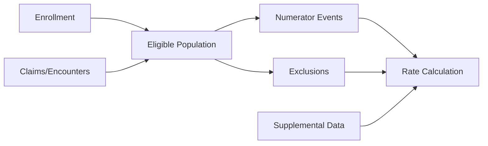

## Why This Post Exists

<!--
ZAHER: Open with why there's a gap in public knowledge. NCQA publishes specifications, health plans publish rates, but nobody publishes how the pipeline works in practice. This is the post you wish existed when you first built one of these pipelines.
-->

## The Shape of a HEDIS Measure Pipeline

<!--
ZAHER: Describe the high-level DAG. Consider including a mermaid diagram like:

Explain how every HEDIS measure follows this same pattern with variations in the specifics. This is the mental model.
-->

## Choosing a Representative Measure

<!--
ZAHER: Explain why you're using Controlling High Blood Pressure (CBP) as the walkthrough example. It's a hybrid measure that touches both administrative (claims) and clinical (BP readings) data, which makes it representative of the complexity most pipelines need to handle.
-->

## Step 1: Eligible Population Identification

<!--
ZAHER: Walk through continuous enrollment checks, anchor dates, age criteria, benefit verification. Discuss the continuous enrollment gap tolerance and how you handle it in SQL/dbt. Mention the practical pain points:
- Enrollment gaps that fall just outside tolerance windows
- Retroactive enrollment changes
- How you handle members who age into/out of eligibility mid-measurement year
-->

## Step 2: Numerator Event Detection

<!--
ZAHER: For CBP specifically: identifying qualifying BP readings across claims data and clinical data sources. Cover:
- Value set matching for diagnosis codes, procedure codes, and encounter types
- The difference between administrative-only and hybrid data collection
- How you structure the SQL to match events against NCQA value sets
- Handling multiple numerator events per member (which one wins?)
-->

## Step 3: Exclusion Logic

<!--
ZAHER: Walk through required exclusions and optional exclusions. Cover:
- How exclusion hierarchies work (some exclusions override numerator compliance)
- The lookback period differences across exclusion types
- Pregnancy exclusion as a concrete example of why exclusion timing matters
- How you structure exclusion logic to be auditable
-->

## Step 4: Supplemental Data Integration

<!--
ZAHER: This is where hybrid measures get interesting. Cover:
- Clinical data sources: EHR extracts, HIE feeds, lab interfaces
- How supplemental data overlays the administrative baseline
- Data quality challenges: missing timestamps, inconsistent units, duplicate records
- The practical difference supplemental data makes to rates (it's often 10-20+ percentage points)
-->

## Step 5: Rate Calculation

<!--
ZAHER: The math is simple (numerator / denominator). The engineering is not. Cover:
- How you aggregate from member-level to measure-level rates
- Stratification requirements (age, gender, product line)
- How you handle the "and/or" logic in multi-component measures
- Reporting entity rollups (provider, plan, contract)
-->

## Step 6: Data Quality Checks That Catch Real Failures

<!--
ZAHER: This is where practitioner knowledge shines. Cover the checks you actually run:
- Rate reasonability checks (is this rate plausible for this population size?)
- Year-over-year drift detection
- Enrollment-to-denominator ratio sanity checks
- Supplemental data contribution tracking
- The most common failure modes you've seen in production
-->

## Pipeline Architecture Choices

<!--
ZAHER: Brief section on technology choices. How does this look in dbt? What's the model layering (staging → intermediate → mart)? How do you handle the annual measurement year boundary? How do you run this for both current-year monitoring and final submission?
-->

## What I'd Tell Someone Building Their First HEDIS Pipeline

<!--
ZAHER: Close with practical advice. What do you wish you knew on day one? What are the non-obvious gotchas that only experience teaches?
-->
