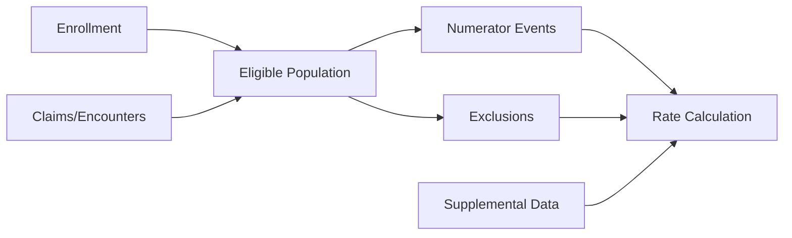

## Why This Post Exists

NCQA publishes the HEDIS technical specifications every year -- several hundred pages of measure definitions, value sets, and reporting guidance. Health plans publish their rates. What nobody publishes is how the pipeline connecting those two things actually works.

If you're a data engineer new to healthcare, you'll read the spec and find it thorough and precise. Then you'll sit down to build the pipeline and realize the spec tells you what to compute but not how to structure the code that computes it. The enrollment logic alone has edge cases described in a paragraph that take weeks to implement correctly.

This post is the walkthrough I wish had existed the first time I built one of these pipelines. It uses Controlling High Blood Pressure (CBP) as the running example -- a measure that touches both administrative claims data and clinical readings, which makes it representative of the full complexity. By the end you should have a working mental model of the pipeline structure and the practical failure modes that don't appear until you're in production.

A note on terminology before we get into it. HEDIS stands for Healthcare Effectiveness Data and Information Set. It's maintained by NCQA (National Committee for Quality Assurance) and is the standard set of performance measures used to evaluate health plan quality. Plans calculate their HEDIS rates annually and report them -- those rates feed into CMS Medicare Star Ratings and public quality reporting. The stakes are real: Star Ratings affect plan revenue directly through quality bonuses, and they affect member enrollment indirectly through consumer-facing plan comparisons.

---

## The Shape of a HEDIS Measure Pipeline

Every HEDIS measure follows the same basic computation pattern regardless of how complex the clinical logic gets. You start with an enrolled population, apply eligibility criteria to define the denominator, match numerator-qualifying events against that denominator, apply exclusions, layer in supplemental clinical data, and compute the rate.



A few things to note about this structure before going further.

Enrollment feeds the eligible population build, but so does claims data. In practice, eligibility files and claims files come from different source systems with different latency profiles. A member can appear in a claim before their enrollment record is fully processed -- this causes intermittent denominator discrepancies that are hard to debug without a clear mental model of which input drives which output.

Supplemental data feeds directly into rate calculation, not into numerator event detection. This is a conceptual distinction that matters for auditability: you want to know whether a member's compliance was established administratively or via supplemental clinical data. Keeping those lineages separate makes audits tractable.

Exclusions sit parallel to numerator events, not downstream of them. A member can be excluded before you ever check whether they have a compliant event. Getting the ordering wrong here produces incorrect denominators, which produces incorrect rates, which compounds downstream.

---

## Choosing a Representative Measure

Controlling High Blood Pressure (CBP) is a good teaching example for several reasons.

The denominator is relatively straightforward: members 18-85 with a diagnosis of hypertension who have been continuously enrolled during the measurement year. The numerator is more interesting: members whose most recent blood pressure reading during the measurement year shows adequate control, defined as systolic below 140 and diastolic below 90. The measure is hybrid, meaning NCQA allows both administrative (claims-based) and clinical (EHR, lab) data to establish numerator compliance.

This forces you to solve problems that simpler, admin-only measures let you avoid: clinical data integration, BP reading validation and unit normalization, the logic for selecting the "most recent" qualifying event, and reconciliation of administrative and clinical records that may represent the same encounter.

---

## Step 1: Eligible Population Identification

The eligible population -- what HEDIS calls the denominator -- is not simply everyone enrolled in the plan. You apply a set of criteria that varies by measure. For CBP, those criteria are:

- **Age**: 18 through 85 as of December 31 of the measurement year
- **Continuous enrollment**: Enrolled for the full measurement year (January 1 through December 31), with no more than one gap of up to 45 days
- **Benefit coverage**: Medical benefits (not pharmacy-only enrollment)
- **Diagnosis**: At least one outpatient visit with a hypertension diagnosis, or a hypertension diagnosis in any inpatient or outpatient claim during the year prior to or during the measurement year

The continuous enrollment check is where most of the implementation complexity lives.

### Handling enrollment gaps

HEDIS allows a gap tolerance for many measures: one gap of up to 45 days is permissible without disqualifying the member. The gap has to be a single gap -- two gaps of 20 days each do not add up to one permissible gap. In production data you'll encounter members with complex enrollment histories: coverage lapses, retroactive reinstatements, multiple span records that overlap slightly due to system artifacts. You need to clean those spans before applying the gap logic.

In SQL terms, the enrollment check involves:
1. Ordering a member's enrollment spans chronologically
2. Identifying breaks between spans where one span ends and the next begins more than one day later
3. Verifying that there is at most one such break spanning no more than 45 days

```sql
-- enrollment_spans: one row per continuous enrollment period per member
-- columns: member_id, span_start, span_end

with ordered_spans as (
    select
        member_id,
        span_start,
        span_end,

        -- look at the previous span's end date for this member
        -- this gives us the prior span boundary to compute gap size
        lag(span_end) over (
            partition by member_id
            order by span_start
        ) as prev_span_end

    from enrollment_spans
    where measurement_year = 2025
),

gaps as (
    select
        member_id,

        -- gap in days: distance between end of prior span and start of this one
        -- subtract 1 because adjacent dates (e.g., Jan 31 / Feb 1) are not a gap
        datediff('day', prev_span_end, span_start) - 1 as gap_days

    from ordered_spans

    -- prev_span_end is null for the first span per member -- skip those rows
    where prev_span_end is not null

    -- only count real gaps, not overlapping spans (which some enrollment systems produce)
    and span_start > prev_span_end
),

gap_summary as (
    select
        member_id,
        count(*)        as gap_count,
        max(gap_days)   as max_gap_days
    from gaps
    group by member_id
)

-- members who pass: at most one gap, and that gap is no longer than 45 days
-- members with no gaps at all won't appear in gap_summary -- handle with left join upstream
select member_id
from gap_summary
where gap_count <= 1
  and max_gap_days <= 45
```

### Retroactive enrollment changes

Health plans receive retroactive enrollment corrections from payers -- a member's start date changes, a span is terminated, a coverage type is updated. If you're building for production monitoring (running the pipeline mid-year on a rolling basis), you need to version your enrollment snapshots so you can reconstruct the population as it looked at any prior point in time. Processing claims against a corrected enrollment file without tracking when that correction arrived produces denominator mismatches between runs that are hard to diagnose.

### Mid-year age transitions and anchor dates

CBP uses age as of December 31. You compute it once and it's fixed for the measurement year. Other measures use different anchor dates -- date of service, or an anchor date based on a qualifying clinical event. Always confirm which anchor date the spec requires before writing the age predicate. Using the wrong one produces systematic denominator errors that may not surface until external validation.

---

## Step 2: Numerator Event Detection

For CBP, a member meets the numerator if their most recent blood pressure reading during the measurement year shows systolic below 140 and diastolic below 90. That sentence contains three non-trivial implementation decisions.

### "Most recent" selection

If a member has multiple BP readings during the year, only the most recent one counts. This means you collect all qualifying BP events for the member, rank them by date descending, and apply the compliance threshold only to rank 1.

```sql
-- bp_events: one row per BP reading per member
-- columns: member_id, reading_date, systolic_value, diastolic_value, source_type

with ranked_readings as (
    select
        member_id,
        reading_date,
        systolic_value,
        diastolic_value,
        source_type,   -- 'administrative' or 'supplemental' -- needed for lineage tracking

        -- rank readings newest-first within each member
        -- ties (same date) are broken arbitrarily; document your tiebreak logic
        row_number() over (
            partition by member_id
            order by reading_date desc
        ) as reading_rank

    from bp_events

    -- only process members who are in the eligible denominator
    where member_id in (select member_id from eligible_population)

    -- only readings from within the measurement year
    and reading_date between '2025-01-01' and '2025-12-31'

    -- readings must have both components; drop nulls explicitly rather than letting them slip through
    and systolic_value is not null
    and diastolic_value is not null
)

select
    member_id,
    systolic_value,
    diastolic_value,
    source_type,
    reading_date,

    -- compliance is a yes/no flag on the most recent reading only
    -- both components must meet threshold; they are evaluated together, not independently
    case
        when systolic_value < 140 and diastolic_value < 90 then 1
        else 0
    end as numerator_compliant

from ranked_readings
where reading_rank = 1    -- only the most recent reading per member
```

### Value set matching

HEDIS provides value sets for CPT, HCPCS, ICD-10, LOINC, and other code systems that define which codes qualify as numerator events. For CBP, relevant codes identify outpatient visit types and LOINC codes for BP panel components. Value sets are published by NCQA and updated annually.

In a production pipeline you do not hardcode these. You load the NCQA-published value sets into a reference table and join against them:

```sql
-- value_set_codes: reference table populated from NCQA's annual value set files
-- columns: value_set_name, code_system, code, measure_year

select distinct
    c.member_id,
    c.service_date,
    c.procedure_code

from claims c

-- join to the value set to confirm this procedure code qualifies
inner join value_set_codes vs
    on  c.procedure_code  = vs.code
    and vs.code_system    = 'CPT'
    and vs.value_set_name = 'Office Visit'
    and vs.measure_year   = 2025            -- always pin to the measurement year

where c.member_id in (select member_id from eligible_population)
```

Value sets are updated annually and occasionally mid-year. Treating them as versioned reference data -- with a `measure_year` column and a consistent load process -- is more maintainable than hardcoded `IN` lists scattered through your SQL. When NCQA adds or removes codes between years, a versioned table makes the change auditable.

### Administrative vs. hybrid collection

In administrative-only collection, you infer BP control from claims codes -- certain CPT codes indicate encounter types where a BP reading is expected to have been taken. In hybrid collection, you supplement with actual numeric readings from EHR data, which allows you to evaluate the 140/90 threshold directly. The two modes identify different populations of compliant members. Hybrid almost always produces higher rates, typically 10-20 percentage points higher, because BP readings are documented in EHRs far more consistently than they're captured on claims.

---

## Step 3: Exclusion Logic

HEDIS exclusions come in two types: required and optional. Required exclusions must be applied -- they remove members for whom the measure is not clinically appropriate. Optional exclusions give plans flexibility to remove members meeting certain criteria, but plans are not obligated to apply them.

For CBP, key required exclusions include:
- ESRD (end-stage renal disease)
- Kidney transplant during the measurement or prior year
- Advanced illness combined with frailty, for members 66 and older

### Exclusion hierarchies

The order in which you apply exclusions matters for auditing. A member who meets both an ESRD exclusion and an advanced illness exclusion should be assigned a single exclusion reason, and that reason should be the one with the highest priority per your specification. The typical pattern: assign a priority value to each exclusion category and keep only the first applicable one per member.

```sql
with exclusion_candidates as (

    -- ESRD: highest priority exclusion for CBP
    select ep.member_id, 'ESRD' as exclusion_reason, 1 as priority
    from eligible_population ep
    inner join esrd_diagnoses esrd
        on ep.member_id = esrd.member_id
        and esrd.diagnosis_date <= '2025-12-31'    -- within lookback window

    union all

    -- Kidney transplant: check measurement year and prior year
    select ep.member_id, 'KIDNEY_TRANSPLANT' as exclusion_reason, 2 as priority
    from eligible_population ep
    inner join transplant_procedures tx
        on ep.member_id = tx.member_id
        and tx.procedure_date between '2024-01-01' and '2025-12-31'

    union all

    -- Add additional exclusion types here, incrementing priority
    -- Document the priority ordering and its source in the spec

),

first_exclusion as (
    select
        member_id,
        exclusion_reason,

        -- keep only the highest-priority exclusion per member
        row_number() over (
            partition by member_id
            order by priority
        ) as rn

    from exclusion_candidates
)

select member_id, exclusion_reason
from first_exclusion
where rn = 1
```

### Lookback period differences

Not all exclusions use the same lookback window. Some require a diagnosis within the measurement year. Some look back two years. Some have a "persistent" definition requiring multiple diagnosis codes across multiple visits within a given period. Parameterize lookback dates against your measurement year variable rather than hardcoding calendar dates. If you run this pipeline for multiple years or in a monitoring mode against mid-year data, hardcoded dates will produce wrong results silently.

### Pregnancy as an example of timing sensitivity

Pregnancy exclusions illustrate why exclusion timing matters independent of the specific criteria. The exclusion window is typically anchored to a gestational period, which you estimate from claims data -- a delivery code, a pregnancy diagnosis, or an expected delivery date code. Members can be excluded for a period that extends backward from a delivery date that appears late in the measurement year. If you apply the exclusion only forward from the diagnosis, you'll include members who should have been removed for the period before the delivery date appeared in your data.

---

## Step 4: Supplemental Data Integration

Supplemental data is where hybrid measures like CBP diverge significantly from simpler, admin-only measures.

### What supplemental data looks like in practice

Clinical data for HEDIS typically arrives via:

- **EHR extracts**: Structured exports from Epic, Cerner, athenahealth, or similar systems. Format varies by vendor -- HL7, C-CDA, or custom flat files. Content depends on what the vendor chooses to expose, which is often a subset of what you need.
- **Lab interfaces**: HL7 v2 ORU messages or FHIR Observation resources containing lab results and vital signs. BP readings come through lab interfaces when collected as part of a structured encounter workflow.
- **HIE feeds**: Health Information Exchange data aggregated from multiple EHR systems. These can dramatically increase coverage -- especially for members who receive care across multiple facilities -- but carry their own data quality issues.

For CBP you're looking for blood pressure readings structured as a systolic component and a diastolic component, with a timestamp, a LOINC code (55284-4 for a BP panel, or 8480-6 / 8462-4 for the components individually), and a source facility identifier.

### Data quality problems you will encounter

**Missing timestamps**: A reading arrives with a date but no time. For CBP this is tolerable since date-level precision is sufficient. For measures where the sequence of events within a day matters, missing times are a real problem.

**Inconsistent units**: BP readings are almost universally in mmHg so this is less of an issue for CBP than for lab-based measures. HbA1c values, for example, arrive in both % (NGSP) and mmol/mol (IFCC), and a pipeline that doesn't normalize units will produce wrong compliance flags.

**Duplicate records**: Very common. The same encounter may appear in both the EHR extract and the claims file, sometimes with slightly different dates or facility codes. You need a deduplication strategy and you need to apply it before you do "most recent reading" selection, because duplicates with slightly different dates will push the apparent most-recent reading to whichever duplicate has the later timestamp.

The standard deduplication key for BP readings is member ID plus reading date plus facility plus LOINC code. Keep one record per key and track the source type for auditability.

### How much supplemental data moves the rate

The effect is consistently material. For BP-based measures, hybrid collection typically adds 10-20 percentage points to the observed compliance rate compared to admin-only. The reason: BP readings are documented in EHRs systematically, as a standard vital sign at every outpatient visit, in a way that simply doesn't show up on claims. A visit note will have a BP. The claim for that same visit has a diagnosis code and a procedure code.

---

## Step 5: Rate Calculation

The math is simple: numerator members divided by denominator members. The engineering is not.

### Member-level to measure-level aggregation

You have a member-level compliance flag from numerator detection and a member-level exclusion flag from exclusion logic. The rate calculation layer joins these and aggregates across reporting dimensions:

```sql
select
    -- reporting dimensions required by NCQA
    product_line,     -- commercial, Medicare, Medicaid
    age_band,         -- defined by the spec; for CBP this is 18-64 and 65-85
    gender,

    -- denominator: eligible members who are not excluded
    count(distinct ep.member_id) as denominator,

    -- numerator: eligible, not excluded, and compliant
    count(
        distinct case
            when ne.numerator_compliant = 1 then ep.member_id
        end
    ) as numerator,

    -- rate: simple division with null guard on zero denominator
    count(
        distinct case
            when ne.numerator_compliant = 1 then ep.member_id
        end
    ) * 1.0 / nullif(count(distinct ep.member_id), 0) as rate

from eligible_population ep

-- left join so that members with no numerator event remain in the denominator
left join numerator_events ne on ep.member_id = ne.member_id

-- left join to identify excluded members
left join exclusions ex on ep.member_id = ex.member_id

-- excluded members drop out of the denominator entirely
where ex.member_id is null

group by
    product_line,
    age_band,
    gender
```

### Stratification requirements and minimum denominators

NCQA requires rates stratified by product line, age band, and gender for most measures. Some stratification cells will have small denominators. NCQA defines minimum denominator thresholds -- commonly 30 members -- below which a rate is suppressed rather than reported. A rate based on 8 members is statistically unreliable and reporting it would be misleading. Implement the suppression logic explicitly; leaving it out produces spurious precision in low-membership cells.

### Multi-component measures

Some HEDIS measures have multiple numerator components, each with its own compliance pathway and its own rate, but sharing a common denominator. Comprehensive Diabetes Care (CDC) is the classic example -- it includes HbA1c testing, eye exams, nephropathy screening, and blood pressure control, each reported separately against the same denominator of diabetic members. The rate calculation layer for these measures must handle component-level rates and composite rates without conflating them. CBP is single-component, which is one reason it's a good first measure to implement.

---

## Step 6: Data Quality Checks That Catch Real Failures

A rate is a number, and a number in isolation tells you very little about whether the pipeline ran correctly. The checks below are the ones that actually catch problems in production.

### Rate reasonability bounds

For a given measure and population type, there's a plausible range based on national benchmarks and your own historical data. If CBP comes in at 12% for a Medicare population, something is wrong -- national rates for Medicare populations run in the 50-70% range depending on plan characteristics. Set hard bounds (flag anything outside a fixed range) and soft bounds (flag anything more than a specified number of standard deviations from your rolling average). Neither should block the pipeline from running, but both should generate reviewer alerts.

### Year-over-year drift

Large single-year swings in a measure rate are almost always a data problem, not a genuine population change. A 15-point drop in CBP from one year to the next warrants investigation before you report it. The most common causes: a supplemental data feed that stopped updating partway through the year, an enrollment file that introduced duplicates, or a value set update that reclassified events you were previously counting.

### Enrollment-to-denominator ratio

Your denominator should be a predictable fraction of your total enrolled population. If your enrolled population is 100,000 members and approximately 60% are in the CBP-eligible age range and have hypertension diagnoses, the denominator should be in that vicinity. A dramatic ratio change -- denominator suddenly 20% of enrolled -- points to a problem upstream of the measure logic, usually in enrollment processing or in the continuous enrollment filter.

### Supplemental data contribution tracking

For hybrid measures, track separately how many compliant members were established via administrative data only vs. supplemental data. If the supplemental data contribution drops to zero, your clinical data feed has failed silently. If it spikes unexpectedly, you may have a duplicate records problem inflating apparent coverage.

### Common production failure modes

These are the ones that appear most often:

- Enrollment file delivered in a new format or with a schema change that silently breaks span-building logic. The pipeline runs without errors and produces a denominator that is wrong.
- Value set update applied to one environment but not another, causing monitoring and submission pipelines to disagree.
- Clinical data extract missing a facility or date range due to a vendor configuration change with no change notification.
- A diagnosis-based exclusion applied with a hardcoded lookback date that wasn't updated for a new measurement year, removing members who should not be excluded.

---

## Pipeline Architecture Choices

### dbt model layering

A HEDIS pipeline maps cleanly onto a three-layer dbt architecture.

**Staging**: Raw source cleaning. One model per source -- enrollment files, claims, supplemental data feeds. Type casting, column renaming, basic null handling. No business logic here. The purpose of this layer is to produce clean, consistently typed inputs so that intermediate models don't have to worry about format variance across sources.

**Intermediate**: Business logic. Enrollment span building, value set joining, event classification, exclusion determination. One model per logical unit. These models reference staging models and produce member-level records. This is where the clinical and enrollment logic lives, and where most of the complexity concentrates.

**Mart**: Rate calculation and reporting aggregations. These consume intermediate models and produce final measure-level rates and denominator/numerator counts per stratification cell. The mart layer should be relatively thin -- the mart shouldn't contain business logic that belongs in intermediate.

The measurement year is controlled by a dbt variable (`var('measurement_year')`) passed through the project, which allows you to run the pipeline for different measurement years without touching model SQL. Date ranges, age calculations, lookback windows, and value set joins all parameterize against this variable.

### Current-year monitoring vs. final submission

HEDIS pipelines typically need to serve two modes: ongoing monitoring, running monthly or quarterly against incomplete data to track performance trajectories; and final submission, running once against a complete, closed measurement year. These modes differ in how incomplete enrollment, late-arriving claims, and partially reconciled supplemental data should be treated.

The cleanest approach is to implement these as different invocation modes of the same pipeline controlled by a `run_mode` variable, rather than maintaining separate pipelines. The core logic is identical; the differences are in date filter cutoffs and how the pipeline handles data that hasn't yet arrived for a monitoring run.

---

## What I'd Tell Someone Building Their First HEDIS Pipeline

**Read the spec, then read it again.** The technical specifications are precise but dense. The first read gives you the logical structure. The second read, after you've started building, surfaces the edge cases you missed the first time. Pay specific attention to the difference between Administrative Specification and Hybrid Specification sections -- they're not identical logic operating on different data sources, they're genuinely different methods that can produce different eligible populations and different event definitions.

**Model enrollment first and get it right.** More HEDIS pipeline bugs originate in enrollment logic than anywhere else. The gap tolerance, retroactive corrections, and mid-year transitions produce edge cases that only appear in production data at scale. Build the enrollment model, write tests against known edge cases, and validate the denominator count against an external reference before you touch numerator or exclusion logic. Debugging a rate discrepancy caused by enrollment errors after the full pipeline is built is much harder than catching it early.

**Version your value sets.** NCQA updates value sets annually and occasionally mid-year with errata. Store them with a `measure_year` column and always join on it. If you find yourself hardcoding CPT codes or ICD-10 codes inline in SQL, stop and move them to the reference table.

**Track data lineage at the member level.** For any given member, you want to know: why are they in the denominator, what numerator events were found, what data source established compliance, and were they excluded and why. This makes audits tractable. Without member-level lineage, a rate discrepancy between your pipeline and a vendor's output becomes a multi-day investigation.

**Expect supplemental data to be messy.** Clinical data feeds are inconsistently structured, arrive late, contain duplicates, and occasionally have a facility's or a date range's worth of records missing with no notification. Build your supplemental data integration layer defensively: validate schemas on ingest, track record counts by source and date, alert on unexpected drops in volume, and make it easy to identify which members' compliance depends on supplemental data vs. administrative data alone.

**The spec is the source of truth, not your vendor.** If you're validating against a commercial HEDIS software vendor and your numbers disagree, don't assume the vendor is right. Work backward from the spec. Vendors have implementation bugs and make interpretation choices that may or may not align with what a careful reading of the specification supports. Knowing the spec well enough to challenge a vendor's output is one of the most practically useful things you can develop in this domain.