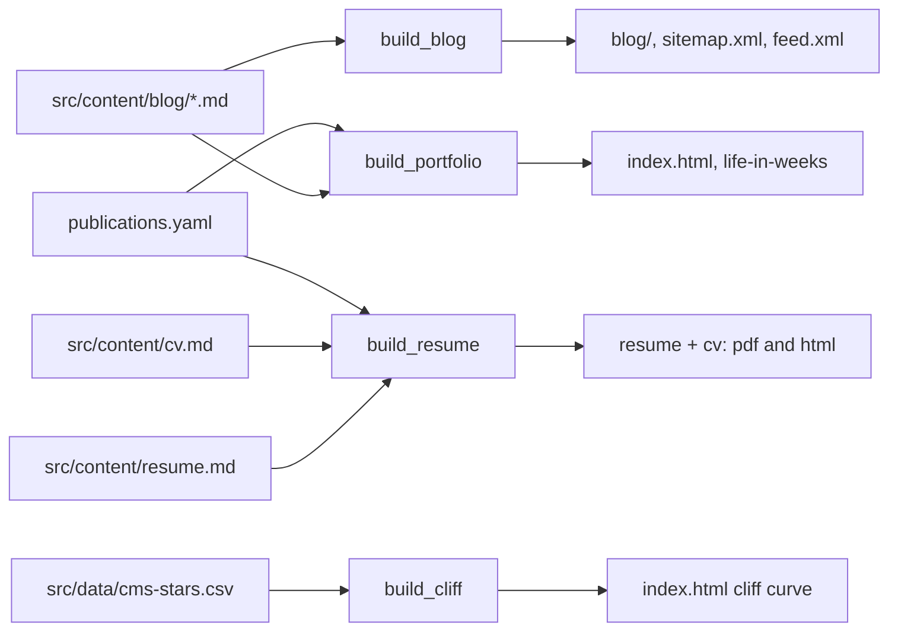
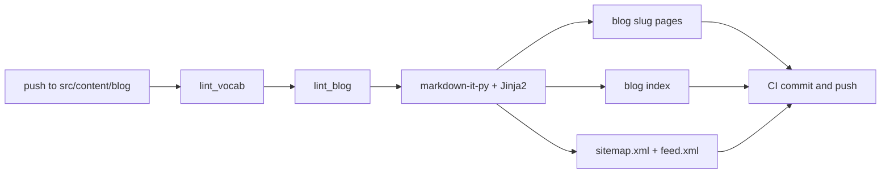
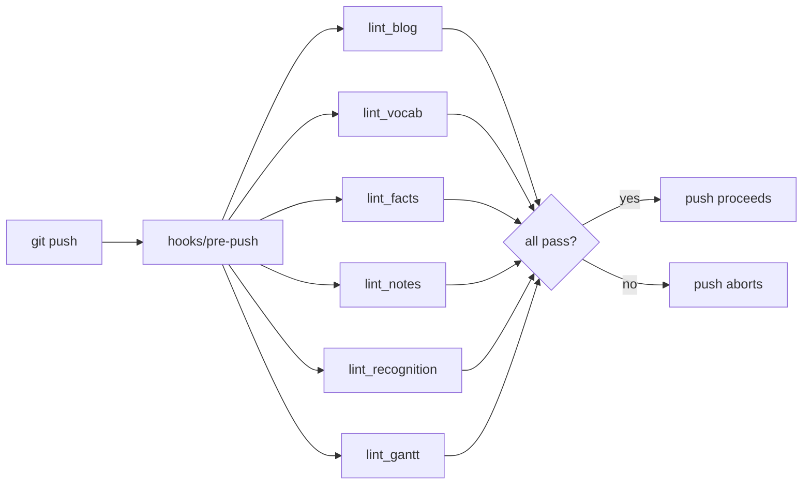

# How This Site Builds Itself

There is a thing people say about static sites: they are just files. No database, no framework, no build, you just edit the HTML and push. That is true for the surface of this site, and not quite true for any of the source that produces it. The homepage is hand-authored HTML, but the blog is not HTML at all in the repo. It is markdown with frontmatter, linted on the way in and rendered on the way out. The resume is not a PDF in the repo. It is markdown that becomes a PDF on every push, and so is the CV next to it. The activity sparkline above the writing section, the eight most recent post entries, the citation counts on each publication: none of those are hand-maintained. They are outputs of scripts that run in CI and commit themselves back.

The reason I bring this up is that "no framework" is often confused with "no build system." It is not the same thing. A framework is a set of opinions about how a build system should be assembled. Removing the framework does not remove the build system. It just hands you the assembly job. This post is about how I did that assembly for this site, what each pipeline does, and a thing I did not expect when I started: that almost every pattern I reached for by instinct turned out to have a name in the literature. The build is small and homemade, but it is made of the same primitives a much larger system is made of, and seeing them at this scale is part of why I keep it homemade.

## The shape

There are five Python build scripts in `scripts/` and six linters that guard them. Three of the build scripts run in CI on every relevant push. Two are manual. The linters run twice: once locally before a push, once again in CI.



Each pipeline reads a source under `src/content/` (or, for two of them, a region of `index.html`), transforms it, and commits the output back to the repo on the same CI run that triggered it. The only network call at build time is to Semantic Scholar, for citation counts. Everything else is local and deterministic.

A useful way to read that diagram is by what each arrow *derives*. `index.html` is partly primary data (the hand-authored prose) and partly derived data (the bits build scripts own). `publications.yaml` is primary data with two derived projections: the homepage block and the CV's publication list. The whole site is a small dependency graph of primary sources and the artifacts computed from them, which is exactly what a build system is, framework or no framework.

## A post, from `blog new` to live

Before the individual pipelines, the workflow that ties them together. There is a small CLI, `scripts/blog`, that I symlink onto my PATH. Writing a post looks like this:

```
$ blog new "How This Site Builds Itself"
Description: ...
Tags: portfolio, static-site, ci-cd
✓ wrote src/content/blog/how-this-site-builds-itself.md
  slug:   how-this-site-builds-itself
  status: draft
```

`blog new` scaffolds the frontmatter with `draft: true` baked in, slugifies the title into the filename, and drops me into `$EDITOR`. The frontmatter is serialized with `yaml.safe_dump`, not string interpolation, so a title with a colon or a quote in it does not produce broken YAML. That is a small thing that bites everyone exactly once.

While drafting, `blog preview` renders the post (drafts included) to a tempfile and opens it in a browser, without flipping the `draft` bit on disk or touching the real `blog/` output. When it is ready:

```
$ blog publish how-this-site-builds-itself
pre-flight
  ✓ lint_blog   ✓ lint_vocab   ✓ lint_facts
post
  draft:        true → false
proceed? [y/N]
```

`blog publish` runs the linters, flips `draft: false`, commits with a `Blog-CLI-Linted:` trailer in the message, and pushes to `main`. That push is where the build system wakes up. The commit touches a file under `src/content/blog/`, which matches the path filter on two workflows at once: `build_blog.yml` rebuilds the post into `blog/<slug>/index.html` and regenerates the listing, the sitemap, and the feed; `build_portfolio.yml` regenerates the homepage sparkline and the writing list so the new post appears on the front page on the same run that publishes it. Both workflows commit their generated output back to `main` under the `github-actions[bot]` identity.

The publish command has one guard worth calling out, because it encodes a footgun I hit. If you run `blog publish` from a feature branch, `git push HEAD:main` would push HEAD *and every ancestor not yet on `origin/main`*, dumping unrelated work onto production. So the command fetches `origin/main`, counts how far ahead HEAD is, and refuses unless the publish commit is the only thing ahead. The safe path is to publish from `main`; the branch path is gated behind `--force-branch` and the ahead-count check. The lesson generalizes: a convenience command that pushes to production should make the dangerous case loud, not the safe case convenient.

## The blog pipeline

This is the largest of the five. It reads markdown with YAML frontmatter, lints it, renders it through markdown-it-py and Jinja2, and writes one `blog/<slug>/index.html` per post, plus the listing pages, an RSS `feed.xml`, and a `sitemap.xml`. It also splits the archive: posts from 2009 through 2011 (the undergraduate-era journalism pieces) go to `/blog/archive/` so the main listing reads as a coherent data-engineering portfolio.



Two things in this pipeline are worth saying out loud, and both are instances of a more general idea.

The first is that math is stashed before markdown parsing. Posts use LaTeX-style delimiters (`\(...\)` for inline, `\[...\]` for display) rather than the more conventional dollar-sign pairs. The reason is that I write about healthcare finance, which means dollar signs are currency. An earlier version of the pipeline tried to auto-detect math by pairing any two dollar signs in a paragraph, and it cheerfully misparsed sentences like "**$4.6 billion** ($1.9 billion cut)". The literal stars survived into the rendered HTML and the math output was nonsense. Switching delimiters made the distinction unambiguous at the source level.

What the build script does with those delimiters is the part with a name. It walks the markdown, replaces every math region with an opaque placeholder like `@@MATHSTASH0@@`, runs the markdown renderer over the placeholdered text, and then substitutes the original math back in verbatim. Crucially, it only does this in prose regions; code fences and inline code are passed through untouched, so a shell tutorial that legitimately contains a backslash-paren is not mistaken for math. This is the protect-transform-restore sandwich, the same move a compiler's lexer makes when it tokenizes string literals so the parser never sees their contents, or that any templating system makes when it escapes a region it does not want interpreted. The general principle: when one pass would corrupt input that a later pass needs intact, lift that input out, run the pass, and put it back. Regex is the wrong tool for parsing a grammar, but it is exactly the right tool for *carving out the spans you refuse to let the grammar touch*.

The second is the Mermaid rewrite. Markdown-it renders a fenced mermaid block as `<pre><code class="language-mermaid">`. The Mermaid runtime, however, looks for `<pre class="mermaid">`. A regex post-pass in the build script bridges the gap (and unescapes the entities markdown-it added, so Mermaid sees raw `-->` arrows instead of `--&gt;`). The first time I shipped a post with a Mermaid diagram, it just did not render: the runtime loaded, the block was in the DOM, but the class selector did not match. This is an impedance mismatch between two tools that almost agree on a contract, and the fix is the smallest possible adapter sitting between them. Most of the friction in a homemade build is not algorithmic. It is two components that each work fine and disagree about a string.

## The resume and CV pipeline

Markdown to PDF, via WeasyPrint. It started as one document and is now two: a one-to-two-page resume (`src/content/resume.md` → `resume.pdf` + `resume.html`) and a longer academic CV (`src/content/cv.md` → `cv.pdf` + `cv.html`). Four artifacts, one script.

What makes it one script and not two is that the builder is data-driven. There is a `DOCS` list at the top, and each entry names a source, its two templates, its two outputs, and whether it carries a generated publications section:

```python
DOCS = [
    {"name": "resume", "src": "resume.md", "publications": False, ...},
    {"name": "cv",     "src": "cv.md",     "publications": True,  ...},
]
```

`main()` just loops over `DOCS` and renders each through the shared pipeline. Adding a third document is a new dictionary in that list, not a new branch in the code. This is the open/closed principle in its least ceremonious form: the behavior is open to extension (add data) and closed to modification (the rendering function does not change). When the CV was added, the resume's output bytes did not move, because nothing in the resume's code path changed; the CV is just another row in the table the loop walks. Configuration-as-data beats configuration-as-control-flow almost every time the set of things is open-ended.

The interesting transform here is a regex post-pass that restructures role headers. The markdown looks like this:

```markdown
**Health Catalyst** | Senior Data Engineer
March 2020 – February 2025
*Python, SQL Server, Power BI, T-SQL*
```

Markdown-it renders that as a single `<p>` with `<br>`-separated inlines. That works, but it is hard to style; print CSS cannot target "the third inline span inside this paragraph" without a structural hook. The post-pass rewrites it into a `<header class="role">` with three labelled child elements, and the print CSS targets each cleanly. Writing a full markdown-it plugin for this one shape would be overkill, and the regex is scoped tightly enough (it matches the exact `strong | text <br> text <br> em` shape) that it will not false-match other content. This is the engineering judgment that gets moralized away in style guides that say "never parse HTML with regex": the rule is real, but it is a rule about *parsing arbitrary structure*. Transforming one rigid, self-produced shape is a different problem, and the targeted tool is the right size for it.

The CI runner needs `libpango-1.0-0` and `libpangoft2-1.0-0` installed before WeasyPrint will run; locally on macOS it is `brew install pango` and a `DYLD_FALLBACK_LIBRARY_PATH` prefix. This is exactly the kind of friction a framework hides from you. Doing it by hand once means the dependency is explicit and I know why it is there.

## The portfolio pipeline

This is the one that turned out to be the most fun to write. It owns several regions of `index.html` and one region of the life-in-weeks page, splicing generated content into each between marker comments while leaving the hand-authored prose around them alone:

- A 24-week activity sparkline showing recent posting cadence.
- The two most recent non-draft posts as featured entries, plus the next six as compact tiles.
- Semantic Scholar citation counts on each publication entry.
- A "thought" dot per post injected into the life-in-weeks grid.
- A month-precision "Updated" stamp in the footer.

The insertion points are marker comments:

```html
<!-- activity-grid:start -->
... regenerated content ...
<!-- activity-grid:end -->
```

The script reads the file, splices new content between each pair of markers, and writes it back. Marker-comment splicing is a well-worn pattern: it is how a tool like `conda init` writes a managed block into your shell rc file without owning the whole file, how `// <auto-generated>` regions work in IDEs, how a hundred dotfile managers fence "this part is mine, the rest is yours." It is the simplest way to mix hand-authored and generated content in one file, and it keeps the file itself as the source of truth. The alternatives (a templating layer that owns the whole page, or extracting the generated bits into includes) both add coupling I did not need for five small regions.

The publications block is the most interesting consumer here, because `publications.yaml` is a single normalized source with multiple projections. The homepage renders it one way (Tufte margin-note markup with citation counts), the CV build renders the same list a different way (a numbered academic citation list), and neither owns the data. This is the read-model idea from CQRS at hobby scale: one authoritative source, several views computed from it, no view treated as canonical. When I add a publication, I append one entry to the YAML and both surfaces pick it up.

The citation counts are the only part of any build that touches a network, and Semantic Scholar's public tier rate-limits aggressively; HTTP 429 is routine. The script retries with exponential backoff, and on failure it preserves the cached value rather than wiping it. There is one more wrinkle worth a line: the YAML only ever holds the *latest* count, but on any run where a fresh count actually lands, the script writes a dated snapshot to `data/snapshots/`. The cache holds current state; the snapshots accrete the longitudinal series the cache throws away. That split (mutable current value plus an append-only log of observations) is the same separation event sourcing draws between a projection and its event stream, and it cost about fifteen lines.

## Build amplification

It is worth looking at how much output one source edit produces, because the fan-out is the whole argument for automating it. Editing a single blog markdown file triggers two workflows that, between them, regenerate six files:

<style>
.hsb-trace { stroke-dasharray: var(--hsb-len); stroke-dashoffset: var(--hsb-len); animation: hsb-draw 1s ease-out forwards; }
.hsb-pt { opacity: 0; animation: hsb-fade 0.5s ease-out forwards; }
@keyframes hsb-draw { to { stroke-dashoffset: 0; } }
@keyframes hsb-fade { to { opacity: 1; } }
</style>

<figure>
<svg viewBox="0 0 760 320" xmlns="http://www.w3.org/2000/svg" role="img" aria-label="A fan-out diagram. One source file on the left, one blog post markdown file, connects by lines to six regenerated output files on the right: the post HTML page, the blog index, the RSS feed, the sitemap, the homepage index.html, and the life-in-weeks page. A label notes one source edit produces six regenerated files across two CI commits, none typed by hand." style="width:100%;height:auto;font-family:'et-book',Palatino,Georgia,serif">
  <text x="20" y="24" font-size="11" letter-spacing="1.4" fill="#6a6a6a">BUILD AMPLIFICATION: ONE SOURCE EDIT</text>
  <rect class="hsb-pt" style="animation-delay:0s" x="30" y="138" width="150" height="44" fill="none" stroke="#111" stroke-width="1.4"/>
  <text class="hsb-pt" style="animation-delay:0s" x="105" y="156" font-size="12" fill="#111" text-anchor="middle">1 post .md</text>
  <text class="hsb-pt" style="animation-delay:0s" x="105" y="172" font-size="10" font-style="italic" fill="#6a6a6a" text-anchor="middle">src/content/blog/</text>
  <polyline class="hsb-trace" style="--hsb-len:330;animation-delay:0.3s" points="180,160 320,50 470,50" fill="none" stroke="#6a6a6a" stroke-width="1.2"/>
  <polyline class="hsb-trace" style="--hsb-len:300;animation-delay:0.45s" points="180,160 320,92 470,92" fill="none" stroke="#6a6a6a" stroke-width="1.2"/>
  <polyline class="hsb-trace" style="--hsb-len:290;animation-delay:0.6s" points="180,160 320,134 470,134" fill="none" stroke="#6a6a6a" stroke-width="1.2"/>
  <polyline class="hsb-trace" style="--hsb-len:290;animation-delay:0.75s" points="180,160 320,176 470,176" fill="none" stroke="#6a6a6a" stroke-width="1.2"/>
  <polyline class="hsb-trace" style="--hsb-len:300;animation-delay:0.9s" points="180,160 320,218 470,218" fill="none" stroke="#6a6a6a" stroke-width="1.2"/>
  <polyline class="hsb-trace" style="--hsb-len:330;animation-delay:1.05s" points="180,160 320,260 470,260" fill="none" stroke="#6a6a6a" stroke-width="1.2"/>
  <text class="hsb-pt" style="animation-delay:0.6s" x="478" y="54" font-size="12" fill="#111">blog/&lt;slug&gt;/index.html</text>
  <text class="hsb-pt" style="animation-delay:0.75s" x="478" y="96" font-size="12" fill="#111">blog/index.html</text>
  <text class="hsb-pt" style="animation-delay:0.9s" x="478" y="138" font-size="12" fill="#111">blog/feed.xml</text>
  <text class="hsb-pt" style="animation-delay:1.05s" x="478" y="180" font-size="12" fill="#111">sitemap.xml</text>
  <text class="hsb-pt" style="animation-delay:1.2s" x="478" y="222" font-size="12" fill="#111">index.html</text>
  <text class="hsb-pt" style="animation-delay:1.35s" x="478" y="264" font-size="12" fill="#111">life-in-weeks/index.html</text>
  <text class="hsb-pt" style="animation-delay:1.7s" x="478" y="296" font-size="11" font-style="italic" fill="#7a0000">6 files, 2 CI commits, 0 typed by hand</text>
</svg>
<figcaption>One human commit fans out into six regenerated files across two GitHub Actions runs. The leverage is the point: the cost of keeping the homepage, the sitemap, and the feed in sync with a new post is zero, because none of them are maintained by hand.</figcaption>
</figure>

The interesting consequence is that the homepage is never *wrong* about the blog, because nothing about the blog on the homepage is authored where it could drift. The sparkline, the featured entries, the tiles: all derived. Derived data cannot disagree with its source unless the derivation is broken, and a broken derivation fails loudly in CI rather than quietly on the page.

## The manual pipelines

Two scripts are deliberately off CI, because their inputs change rarely and the failure mode of forgetting to run them is cosmetic, not broken content.

`scripts/build_og.py` rebuilds `og-default.png` (the Open Graph card, 1200 by 630) from inlined design tokens via Pillow. The card content (name, subtitle, domain) changes about once a year. `scripts/build_cliff.py` redraws the Medicare Advantage Star Ratings density curve on the homepage from the canonical CMS distribution in `src/data/`, using a pure-Python Gaussian kernel density estimate so the script has no dependencies beyond the standard library; it gets re-run when CMS releases new ratings each October. Both write into marker regions, both are idempotent, and both are honest about the tradeoff: "you will remember to run it" is an acceptable contract when the worst case is a slightly stale image, and an unacceptable one when the worst case is a published post that never reaches the homepage. Knowing which builds can be manual is itself a design decision, not an oversight.

## The lint suite

Six linters run before every push, via a self-installing pre-push hook, and a subset runs again in CI. None of them produce output files. They either pass or abort the operation.



The first three guard the content pipelines:

`lint_blog.py` catches four storage-side mistakes that the rendered HTML cannot recover from: an HTML comment in a non-draft post (it leaks as visible escaped text), a fenced code block nested inside an HTML comment (the parser bails at the fence), a blockquote line starting with a Mermaid keyword (Mermaid never sees it), and a blank line inside an `<svg>` element (markdown-it terminates the HTML block and reparses the rest of the SVG as markdown, wrapping `<text>` and `<line>` in `<p>` tags). Each of those four caused a real bug in a real post before it became a lint rule. That sequence is the rule I would offer to anyone working on a static site: do not fix the post and move on; fix the post, then write the check that would have caught it. It is regression-test discipline applied to authoring instead of code, and it is the cheapest mistake-proofing there is, the software version of a jig that only lets the part go in the right way.

`lint_vocab.py` enforces canonical CMS program-name capitalization across the blog, resume, CV, and homepage: "Star Ratings" (not lowercase r, not all caps), "Medicare Advantage", "HEDIS", and so on. The patterns are deliberately narrow; they catch proper-noun usage and let common-noun usage through, so "5 stars" passes and a miscased "Star Ratings" does not. It is the kind of small consistency that an audience of practitioners notices and that no human reviewer reliably catches on the hundredth read.

`lint_facts.py` is a cross-surface drift check. It reads the resume, the homepage `h3` titles and meta tags, and the JSON-LD block, and flags inconsistencies: a job title that differs across surfaces, a date range that does not match, a credential on the resume but missing from the structured data. This one exists because of a deliberate denormalization. The same facts live in several hand-authored places on purpose (a resume reads differently from a homepage reads differently from a JSON-LD block), so there is no single source to derive them from. When you choose to denormalize, you take on the obligation to check consistency yourself; `lint_facts` is a referential-integrity constraint enforced by a script instead of a database.

The three newer linters extend that same idea to surfaces that are easy to let drift:

`lint_notes.py` enforces an additivity rule: a homepage sidenote or margin note must not restate a number or a five-word run that already appears in the page prose, and a post's homepage margin note must add something its title and description do not already say. It is a redundancy check against the page's own text.

`lint_recognition.py` keeps the homepage "Service and Recognition" section a subset of the comprehensive record in the CV, without a shared data file. Both surfaces stay hand-authored; the linter parses each and matches entries on shared year plus shared significant tokens, so "Undergraduate Research Mentor" still matches the CV's "Undergraduate Research Scholar Mentor" without a synonym table. The gate is one-directional (the homepage may show fewer items than the CV, never more), so a failure means something is shown publicly with no CV record behind it.

`lint_gantt.py` keeps the hand-coded Education and Service Gantt figure in lockstep with the two prose sections it summarizes, by reading each mark's year back out of its x-coordinate through the chart's own coordinate transform and checking that every section entry has a matching mark. It exists because the figure once silently fell three entries out of date.

The shape across all six is the same: a check that runs as early as possible (pre-push, the earliest place that can still block a mistake), backed up by a second run in CI for anything that reaches `main` another way. That is shift-left and defense-in-depth, named patterns, applied to a personal site.

## When two builds race

Now the part the draft of this post left as a to-do. Because publishing a post fires `build_blog.yml` and `build_portfolio.yml` from the same push, and both commit back to `main`, the two runs are concurrent writers to one shared resource. That is a race, and git resolves it the way any optimistic concurrency control scheme resolves one: the second writer's push is rejected, and it has to re-read and re-apply.

<style>
.hsb-grow { transform: scaleX(0); transform-origin: left; transform-box: fill-box; animation: hsb-grow 0.7s cubic-bezier(0.2,0.7,0.3,1) forwards; }
@keyframes hsb-grow { to { transform: scaleX(1); } }
</style>

<figure>
<svg viewBox="0 0 760 300" xmlns="http://www.w3.org/2000/svg" role="img" aria-label="A swimlane timeline of two GitHub Actions workflows triggered by the same push. The build_blog lane runs and commits to origin/main first. The build_portfolio lane runs longer because of a network citation fetch, then its push is rejected as non-fast-forward because origin/main moved. It fetches and rebases onto the new origin/main, retries the push, and succeeds. The successful retry is the last event on the timeline." style="width:100%;height:auto;font-family:'et-book',Palatino,Georgia,serif">
  <text x="20" y="22" font-size="11" letter-spacing="1.4" fill="#6a6a6a">ONE PUSH, TWO WORKFLOWS, ONE BRANCH</text>
  <text x="14" y="78" font-size="12" fill="#111">build_blog</text>
  <text x="14" y="158" font-size="12" fill="#111">build_portfolio</text>
  <rect class="hsb-grow" style="animation-delay:0s" x="150" y="62" width="170" height="22" fill="#111" opacity="0.18" stroke="#111" stroke-width="1"/>
  <circle class="hsb-pt" style="animation-delay:0.8s" cx="320" cy="73" r="4.5" fill="#111"/>
  <text class="hsb-pt" style="animation-delay:0.9s" x="330" y="58" font-size="11" fill="#111">commit → origin/main</text>
  <line class="hsb-pt" style="animation-delay:1s" x1="320" y1="73" x2="320" y2="150" stroke="#6a6a6a" stroke-width="1" stroke-dasharray="3,4"/>
  <text class="hsb-pt" style="animation-delay:1.1s" x="326" y="118" font-size="10" font-style="italic" fill="#6a6a6a">origin/main moves here</text>
  <rect class="hsb-grow" style="animation-delay:0.2s" x="150" y="142" width="300" height="22" fill="#111" opacity="0.18" stroke="#111" stroke-width="1"/>
  <text class="hsb-pt" style="animation-delay:0.4s" x="300" y="138" font-size="10" font-style="italic" fill="#6a6a6a" text-anchor="middle">runs longer: Semantic Scholar fetch</text>
  <circle class="hsb-pt" style="animation-delay:1.2s" cx="450" cy="153" r="4.5" fill="#7a0000"/>
  <text class="hsb-pt" style="animation-delay:1.3s" x="458" y="150" font-size="11" fill="#7a0000">push rejected (non-fast-forward)</text>
  <rect class="hsb-grow" style="animation-delay:1.5s" x="450" y="172" width="70" height="16" fill="none" stroke="#6a6a6a" stroke-width="1" stroke-dasharray="4,3"/>
  <text class="hsb-pt" style="animation-delay:1.7s" x="485" y="204" font-size="10" font-style="italic" fill="#6a6a6a" text-anchor="middle">fetch + rebase</text>
  <rect class="hsb-grow" style="animation-delay:1.9s" x="520" y="142" width="55" height="22" fill="#111" opacity="0.18" stroke="#111" stroke-width="1"/>
  <circle class="hsb-pt" style="animation-delay:2.2s" cx="575" cy="153" r="4.5" fill="#111"/>
  <text class="hsb-pt" style="animation-delay:2.3s" x="583" y="150" font-size="11" fill="#111">pushed</text>
  <line x1="150" y1="250" x2="720" y2="250" stroke="#d0d0c8" stroke-width="1"/>
  <text x="720" y="268" font-size="10" font-style="italic" fill="#6a6a6a" text-anchor="end">wall clock →</text>
</svg>
<figcaption>Two workflows triggered by one push, both committing to main. build_portfolio runs longer because of its network call, so its push loses the race and is rejected. It rebases onto the freshly moved origin/main and retries. Nothing is lost; the slower writer simply re-applies on top of the faster one.</figcaption>
</figure>

The handling is a few lines of bash in `build_portfolio.yml`. It pushes first (there is no race most of the time, so do not pay for one), and only on a rejected push does it `git fetch origin main` and `git rebase origin/main` and try again, up to five times with a growing sleep. A failed rebase is aborted so the next attempt starts from a clean state instead of wedging half-applied. Mapped to the textbook, git's ref update is a compare-and-swap: the push says "move `main` from the commit I think is there to my new commit," and the swap fails if someone else moved it first. Rejection is a CAS failure; rebase-and-retry is the read-modify-write loop you wrap around any optimistic lock. `build_resume.yml` does the same with `git pull --rebase`. One non-obvious requirement falls out of this: the checkout uses `fetch-depth: 0` (full history, not the default shallow clone) because a rebase needs the merge base, and a shallow clone does not have it. A shallow clone made the rebase fail silently and the old retry loop exhaust itself for nothing.

There is a second concurrency hazard, the kind that bites you only after the first is fixed: a workflow that commits to the branch it watches can trigger itself, forever. GitHub closes that door by design (a push made with the default `GITHUB_TOKEN` does not trigger another workflow run), which is a deliberate loop-breaker and not an accident. It has a side effect, though: when `build_portfolio` writes refreshed citation counts into `publications.yaml`, that write does *not* wake `build_resume`, so the CV would never pick up the new counts. The fix is a clock. `build_portfolio` runs its weekly citation refresh on a Sunday 06:00 cron; `build_resume` runs its own cron an hour later at 07:00, by which point the fresh counts are committed for it to read. The cron is not a timer for its own sake; it is the coordination point that replaces the trigger the loop-breaker swallowed. Concurrency correctness is rarely one clever trick. It is noticing each hazard the previous fix exposed.

## The patterns that rhyme

Step back from the individual scripts and the same handful of patterns recur across all of them. What surprised me is how cleanly each maps onto something with a name.

**Idempotence.** Every pipeline produces the same output for the same input, so running it twice in a row produces no commit on the second run. This is the property that makes a Terraform apply or an HTTP `PUT` safe to retry: convergence to a fixed point, where the operation describes a desired end state rather than a mutation to perform. It is load-bearing here precisely because the workflows commit their own output and sometimes race; the rebase-and-retry loop above only works because re-running after a rebase produces the identical result. Idempotence is what makes a retry loop safe instead of dangerous.

**Marker-comment splicing.** A build script owns named regions inside a file the human otherwise owns. It is the same move as the managed blocks tools write into your shell rc, or `// <auto-generated>` regions in generated code: partial-file generation that keeps the file as the source of truth and avoids handing the whole thing to a template engine. Generate the bits that change; leave the rest alone.

**Graceful degradation on network calls.** The one network dependency fails often enough that I had to design for failure as the normal case, not the exception. Retry with backoff, fall back to last-known-good on failure, and let a later scheduled run reconcile. That is fault tolerance with a stale-while-revalidate cache and an eventual-consistency backstop, three ideas from distributed systems doing honest work in a build for a one-person website. The alternative (fail loud, block the merge on a flaky third party) would have made the build hostage to someone else's rate limiter.

**Single source, many projections.** `publications.yaml` feeds the homepage and the CV; neither view is canonical, both are computed. Where I could not have a single source (the facts that must read differently across resume, homepage, and structured data), I denormalized on purpose and added a consistency check, `lint_facts`, to stand in for the integrity constraint a database would have enforced. Normalize when you can; when you cannot, check.

**Self-bootstrapping hooks.** The pre-push hook installs itself. Every `build_*.py` and `lint_*.py` script calls `install_git_hooks()` at import time, which points git's `core.hooksPath` at `scripts/hooks/` on the first run after a clone and no-ops thereafter. There is no README step to forget and no setup script to drift from reality. The cost is two lines at the top of each script; the benefit is convention over configuration, the machine doing the bootstrap so the human never has to. The right thing happens by default, which is the only kind of "right thing" that survives contact with a busy week.

**Trust tokens and short-circuited work.** This is the subtlest one, and I almost gave it its own post. The `blog` CLI already lints a post before it commits, so re-linting the same content in the pre-push hook and a third time in CI is mostly wasted work. The CLI records that it did the work by writing a `Blog-CLI-Linted:` trailer into the commit message; the hook and the workflow can be configured to *skip* the redundant lint when every commit in the push range carries the trailer. The trailer is a provenance token: a small, verifiable claim ("this content was already linted") that lets a downstream stage trust an upstream one and skip work, the same shape as a build-cache key or a signed attestation. The detail that makes it safe is that it checks *every* commit in the range, not just HEAD, because a push can carry several commits and only trusting the tip would let an unlinted one slip through behind a linted one. A cache is only as good as the precision of its key. The default is still to run every check; the short-circuit is opt-in, because for a personal site the wasted seconds are cheaper than the risk of trusting the token too readily. I decided it does not need its own post. It needs this paragraph and a precise key.

## What this would look like with a framework

If I had built this site on Astro or Next.js or Eleventy, most of the machinery above would be invisible. The framework would render the markdown, optimize the build, and probably hide the citation fetching behind a content-collection abstraction. The linting would be a plugin. The pre-push hook would be a husky config. The marker-comment splicing would not exist, because the framework would own the whole file.

That would be a perfectly good way to build a website, and I would reach for it on someone else's project without a second thought. The cost, for *this* project, is that all of the patterns above would still be there but I would not be able to see them. The race between two writers, the placeholder sandwich, the provenance token, the projections off one source: a framework does not remove those problems, it solves them on your behalf and files the solution somewhere you do not look until it breaks. I would rather meet them at this scale, where each one is forty lines of Python I can read in an afternoon, and where seeing idempotence and optimistic concurrency and shift-left side by side in a tiny system makes them legible in a way a large one never does.

There is a temptation, ending a post like this, to land on a principle about the virtue of building things yourself. I will skip it. The reason this site is a pile of scripts is narrower and a little selfish: I wanted a build I could hold in my head, so that when it breaks at 11pm the fix is a function I wrote and not an issue I file. The scripts are small, the patterns repeat, and every failure mode is one I have already met and named. That is the whole pitch. It is not clever, and it fits in my head, which on a personal site is the only requirement that counts.
