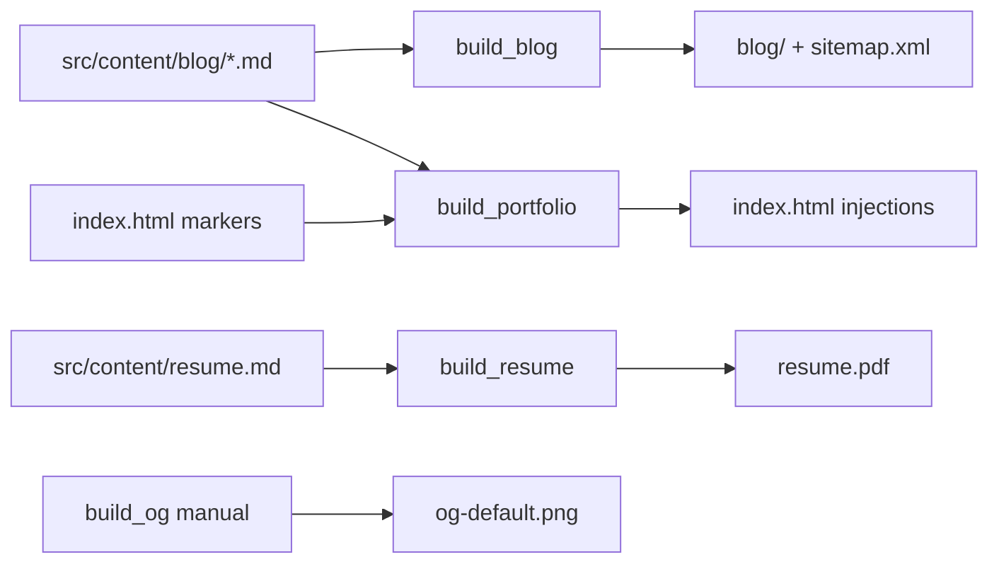
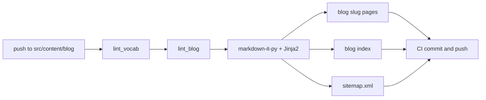
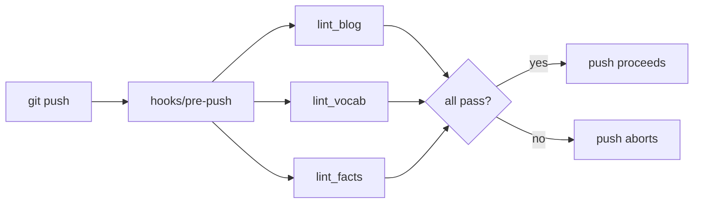

# How This Site Builds Itself

There is a thing people say about static sites: they are just files. No database, no framework, no build, you just edit the HTML and push. That is true for the surface of this site, and not quite true for any of the source that produces it. The homepage is hand-authored HTML, but the blog is not HTML at all in the repo. It is markdown with frontmatter, linted on the way in and rendered on the way out. The resume is not a PDF in the repo. It is markdown that becomes a PDF on every push. The activity sparkline above the writing section, the six most recent post entries, the citation counts on each publication: none of those are hand-maintained. They are outputs of scripts that run in CI and commit themselves back.

The reason I bring this up is that "no framework" is often confused with "no build system." It is not the same thing. A framework is a set of opinions about how a build system should be assembled. Removing the framework does not remove the build system. It just hands you the assembly job. This post is about how I did that assembly for this site, what each pipeline does, and a couple of patterns that turned out to rhyme across all of them.

## The shape

Four Python pipelines in `scripts/`. Three are on CI. One is manual.



Each pipeline reads a source under `src/content/` or `index.html`, transforms it, and commits the output back to the repo on the same CI run that triggered it. The only network call at build time is Semantic Scholar for citation counts. Everything else is local.

## The blog pipeline

This is the largest of the four. It reads markdown with YAML frontmatter, lints it, renders it through Jinja2, and writes one `blog/<slug>/index.html` per post, plus the listing pages and a `sitemap.xml`. It also splits the archive: posts from 2009 through 2011 (the undergraduate-era journalism pieces) go to `/blog/archive/` so the main listing reads as a coherent data-engineering portfolio.



Two things in this pipeline are worth saying out loud.

The first is that math is stashed before markdown parsing. Posts use LaTeX-style delimiters (`\(...\)` for inline, `\[...\]` for display) rather than the more conventional dollar-sign pairs. The reason is that I write about healthcare finance, which means dollar signs are currency. An earlier version of the pipeline tried to auto-detect math by pairing any two dollar signs in a paragraph, and it cheerfully misparsed sentences like "**$4.6 billion** ($1.9 billion cut)". The literal stars survived into the rendered HTML and the rendered math output was nonsense. Switching delimiters made the distinction unambiguous at the source level. No heuristic needed. The build script extracts math regions to placeholders before markdown parsing, then restores them verbatim so KaTeX can pick them up client-side.

The second is the Mermaid rewrite. Markdown-it renders a fenced mermaid block as `<pre><code class="language-mermaid">`. The Mermaid runtime, however, looks for `<pre class="mermaid">`. A regex post-pass in the build script bridges the gap. The first time I shipped a post with a Mermaid diagram, it just did not render. The runtime loaded, the block was in the DOM, but the class selector did not match. The rewrite is one of those small frictions that disappears the moment it is in place.

## The resume pipeline

Markdown to PDF, via WeasyPrint. The source is `src/content/resume.md`. The output is `resume.pdf` (US Letter, single column, ATS-parseable) plus a `resume.html` artifact alongside it.

The interesting part of this pipeline is the regex post-pass that restructures role headers. The markdown looks like this:

```markdown
**Health Catalyst** | Senior Data Engineer
March 2020 – February 2025
*Python, SQL Server, Power BI, T-SQL*

- bullet
- bullet
```

Markdown-it renders that as a single `<p>` with `<br>`-separated inlines. That works, but it is hard to style. Print CSS cannot target "the third inline span inside this paragraph" without a structural hook. The regex post-pass rewrites the rendered HTML to `<header class="role">` with three child elements (`.org-role`, `.dates`, `.stack`), and the print CSS targets each cleanly. Writing a markdown-it plugin for this one shape would be overkill. The regex is targeted enough that it does not false-match other content.

The CI Ubuntu runner needs `libpango-1.0-0` and `libpangoft2-1.0-0` installed before WeasyPrint will run. Locally on macOS it needs `brew install pango` and a `DYLD_FALLBACK_LIBRARY_PATH` prefix. This is the kind of friction that a framework would hide from you. Doing it by hand once means you understand exactly what is installed.

## The portfolio pipeline

This is the one that turned out to be the most fun to write. It updates three pieces of `index.html` in place:

- A 24-week activity sparkline showing recent posting cadence.
- The six most recent non-draft posts in the homepage Writing section.
- Semantic Scholar citation counts on each publication entry.

The insertion points are marker comments:

```html
<!-- activity-grid:start -->
... regenerated content ...
<!-- activity-grid:end -->
```

The script reads `index.html`, splices new content between each pair of markers, and writes the file back. Marker-comment splicing is a well-worn pattern in static-site tooling. It is the simplest way to mix hand-authored content with generated content in the same file. The alternatives (a templating layer that owns the whole file, or extracting the generated bits into includes) both add complexity I did not need.

The citation counts are the only part of any build that touches a network. Semantic Scholar's public tier rate-limits aggressively. HTTP 429 is a regular occurrence. The script retries with exponential backoff. On failure, it preserves the existing value rather than wiping it. Running twice is idempotent. This matters because the workflow runs both on push and on a weekly cron, and a flaky network on Sunday should not wipe last Wednesday's counts.

## The OG image (manual)

`scripts/build_og.py` rebuilds `og-default.png` (the Open Graph card, 1200 by 630) from inlined design tokens via Pillow. It is not on CI because the card content (name, subtitle, domain) changes rarely. Run locally when the design changes. This is the one pipeline where "you will remember to run it" is acceptable. The failure mode is a stale preview-card image, not broken content.

## The lint suite

Three linters run before every push and again in CI. None of them produce output files. They either pass or abort the operation.



`lint_blog.py` catches four storage-side mistakes that the rendered HTML cannot recover from:

- HTML comments in a non-draft post. They leak as visible escaped text because markdown-it does not strip them.
- A fenced code block nested inside an HTML comment. The HTML-block parser bails at the fence and renders the rest of the document as literal text.
- A blockquote line starting with a Mermaid keyword. Markdown renders it as prose with literal arrows escaped; Mermaid never sees it.
- A blank line inside an `<svg>` element. Markdown-it terminates the HTML block at the blank line and reparses the rest of the SVG as markdown, wrapping `<text>`, `<line>`, `<polyline>` in `<p>` tags. The chart breaks.

Each of those four caused a real bug in a real post before it became a lint rule. The pattern I would offer to other people working on static sites: do not fix the post and move on. Fix the post, then write the check that would have caught it. Posts that already shipped are grandfathered (the check runs against fresh sources, not the archive), but the next post gets the check for free.

`lint_vocab.py` enforces canonical CMS program-name capitalization across the blog, resume, and homepage. "Star Ratings" (not lowercase r, not all caps, not "stars ratings"), "Medicare Advantage" (not lowercase), "HEDIS" (the acronym), and so on. The patterns are deliberately narrow. They catch proper-noun usage and let common-noun usage through. "5 stars" passes; "Star Ratings" with the wrong case does not. The reason for caring is that the audience is healthcare-data-engineering practitioners who notice when program names are miscased. It is a small thing. It is the kind of small thing that adds up.

`lint_facts.py` is a cross-surface drift check. It reads the resume, the homepage h3 titles and meta tags, and the JSON-LD block on the homepage, and flags inconsistencies. A job title that differs across surfaces, a date range that does not match, a credential that is on the resume but missing from the structured data. This one has saved me twice: once when I updated a role title on the resume and forgot the homepage, once when the JSON-LD `jobTitle` drifted from the visible text.

## The patterns that rhyme

A few patterns showed up across all four pipelines.

**Idempotence.** Every pipeline produces the same output for the same input. Running `build_blog` twice in a row produces no commit on the second run. Running `build_portfolio` after a failed citation fetch preserves the previous value. This is load-bearing because the CI workflows commit their outputs back to the repo, which sometimes races with other workflows. The rebase-and-retry loop in `build_portfolio.yml` only works because rerunning after a rebase produces the same result.

**Marker-comment splicing.** Three places in `index.html` are hand-authored except for the bits between marker comments. The splicing pattern keeps the file in a single source of truth (the file itself) while letting build scripts own well-defined regions. Do not generate the whole file. Generate the bits that change.

**Graceful degradation on network calls.** The one network call at build time fails often enough that I had to design for it. The script preserves the existing value when the fetch fails, retries with exponential backoff, and treats partial success as acceptable. The weekly cron picks up anything that did not update on the push run. The alternative (fail loud, block the merge) would have been a constant source of flaky builds.

**Self-bootstrapping hooks.** The pre-push hook installs itself. `scripts/_common.install_git_hooks()` is called at the top of every `build_*.py` and `lint_*.py` script. On first run after a clone, it points git's `core.hooksPath` at `scripts/hooks/` and prints a notice. Subsequent runs are no-ops. No README step, no manual setup. The hooks just work the first time anyone runs a project script. The cost is two lines at the top of each script. The benefit is that I never have to remember to set this up on a new machine.

**Redundancy short-circuit.** Three linters run on every push. Running them again in CI is mostly wasted work. The same content is being checked twice. A `Blog-CLI-Linted:` commit trailer (written by `scripts/blog publish`) signals "this commit was linted via the CLI; trust it." Both the pre-push hook and the CI workflow can opt into skipping when every commit in the push range carries the trailer. The toggle defaults to `always` (no skip) and can be flipped per-repo via `blog config set prepush_lint skip|always`. The trailer is the simplest mechanism I could think of that does not require a side database or a coordination service.

## What this would look like with a framework

If I had built this site on Astro or Next.js or Eleventy, most of the machinery above would be invisible. The framework would render the markdown, optimize the build, and probably hide the citation fetching behind a content-collection abstraction. The linting would be a plugin. The pre-push hook would be a husky config file. The marker-comment splicing would not exist because the framework would own the whole file.

That would all be fine. The cost would be that I would not understand any of it. The reason I write a regex post-pass for the resume role block instead of a markdown-it plugin is the same reason I write a `build_portfolio` script instead of importing a content-collection library: the constraint of "I have to write this myself" is exactly the thing that makes me understand what it is doing.

A no-framework portfolio site is not a flex. It is a constraint chosen for a reason. The reason is that I work with healthcare data engineers who, when they ask me what tools I use, deserve a better answer than "the framework handled it." For my own site, the answer is four Python scripts, a YAML config, a pre-push hook, and a couple of CI workflows. None of them are clever. All of them are mine.

---

*Draft notes (strip before publishing): consider adding a concrete walkthrough of one post going from `blog new` to live, a section on the GitHub Actions race-condition handling between `build_blog` and `build_portfolio`, and a closing that sounds less earnest. Verify the Mermaid diagrams render cleanly in light and dark mode. Decide whether the redundancy short-circuit deserves its own post — it is structurally interesting and a little buried here.*
