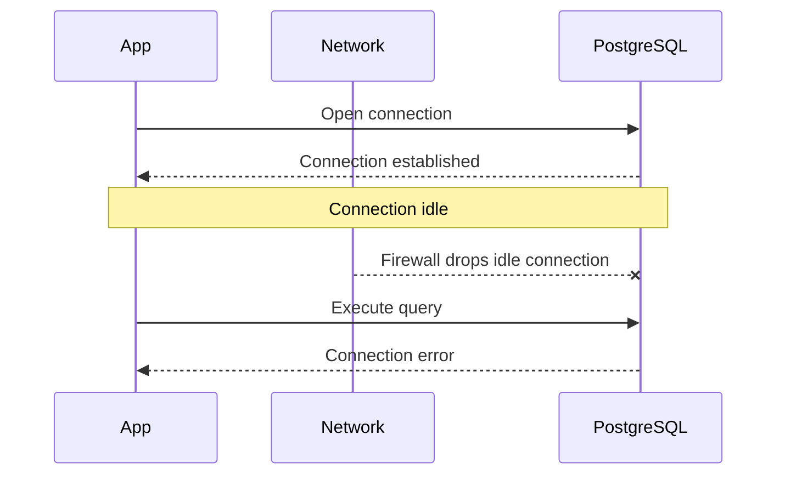
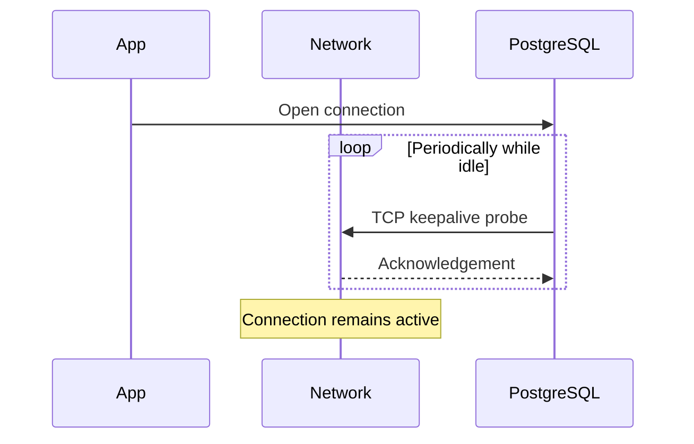

## The Problem: Silent Connection Failure

PostgreSQL connections often fail quietly rather than catastrophically.

Firewalls, NAT devices, and load balancers routinely terminate idle TCP connections without notifying either side. PostgreSQL still believes the client exists, and the client still believes it is connected until the next query fails in a confusing and disruptive way.

TCP keepalive exists to prevent exactly this class of failure.


## What TCP Keepalive Does

TCP keepalive sends lightweight probe packets on idle connections. If the peer responds, the connection remains open. If the peer does not respond, the operating system marks the socket as dead.

This serves two purposes:

- It prevents network equipment from dropping idle connections
- It allows dead peers to be detected earlier and more reliably


## Visualization 1: Failure Without Keepalive



In this scenario, the failure only becomes visible when work resumes long after the real cause.


## Visualization 2: Stability With Keepalive



Small, periodic probes keep the connection visible and verifiable.


## PostgreSQL Keepalive Parameters

PostgreSQL exposes TCP keepalive tuning through three parameters:

| Parameter | Meaning |
|----------|---------|
| tcp_keepalives_idle | Seconds of inactivity before probes begin |
| tcp_keepalives_interval | Seconds between probes |
| tcp_keepalives_count | Failed probes before the connection is closed |

These are typically configured in `postgresql.conf`.


## Why Defaults Often Fail

On many systems, the default idle time before keepalive probes begin is measured in hours.
Many firewalls expire idle connections in minutes.

This mismatch is one of the most common causes of intermittent PostgreSQL disconnects in real-world environments.


## Client and OS-Level Configuration

Some PostgreSQL clients allow keepalive tuning directly. Others only allow enabling keepalive without control over timing.

When client-level tuning is unavailable, adjusting operating system TCP defaults ensures consistent behavior across all PostgreSQL connections on the host.


## Long-Running Queries and Lost Clients

Even if the operating system detects a dead socket, PostgreSQL may continue executing a query that has already started.

PostgreSQL 14 introduced the following setting:

```
client_connection_check_interval
```

This causes PostgreSQL to periodically verify that the client connection still exists and to cancel work if it does not.


## When Keepalive Tuning Is Necessary

Keepalive tuning is particularly important when:

- Connections pass through firewalls or load balancers
- Long-lived or pooled connections are used
- Unexplained connection resets occur
- Fast cleanup of dead sessions matters

## Takeaway

TCP keepalive does not make PostgreSQL faster.

It makes PostgreSQL more predictable.

By aligning PostgreSQL, the operating system, and the network’s expectations of connection liveness, you avoid silent failures and late surprises and gain calmer, more reliable database behavior.
