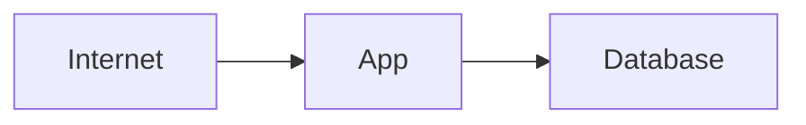
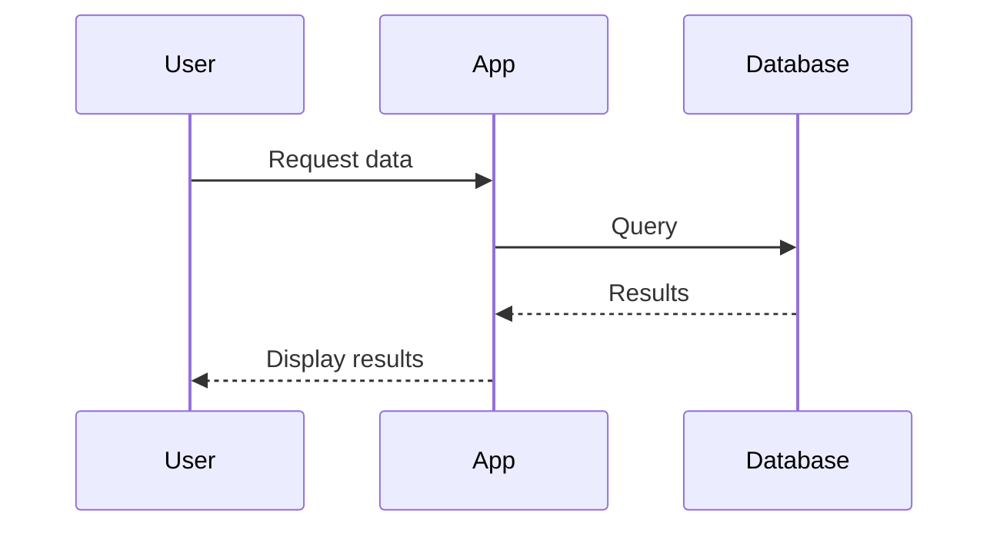

## Simple Flowchart

This is a basic test to verify Mermaid rendering works:

## Sequence Diagram

If you can see the diagrams above rendered as actual flowcharts and sequence diagrams (not code blocks), then Mermaid is working correctly!
